import Tabs from "@theme/Tabs";
import TabItem from "@theme/TabItem";
import Admonition from "@theme/Admonition";

# Setup


## Downloading Aniyomi

Aniyomi is not available on the Google Play Store, so you'll need to download it from the [official website](https://aniyomi.org/).


1. Go to the [downloads page](https://aniyomi.org/download) on the Aniyomi website.

    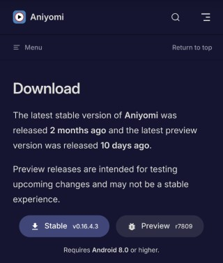

2. Click either `Stable` or `Preview` to download the APK file for Aniyomi.
    :::note
    The `Stable` version is the most stable version of Aniyomi, while the `Preview` version is the latest version with new features and bug fixes.
    The `Preview` versions may have more bugs and cause crashes. Therefore, I recommend downloading the `Stable` version.
    :::
3. The file will now begin downloading. You can check your notifications or the downloads section of your browser to see the progress of the download.

    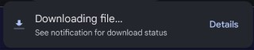
4. Once the download is complete, you should see a notification in your notification bar. Click on the notification to open the file.

    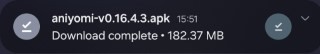
5. If this is your first time installing an APK file, you may get a warning like this:
    
    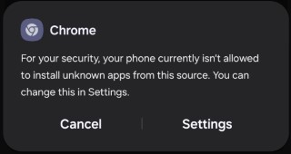

    Click `Settings` to allow the installation of APK files from this source. 

6. You will now be taken to the `Install unknown apps` page. 

    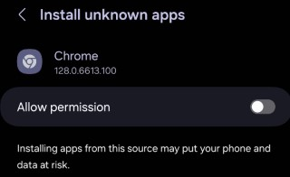
    
    Click the `Allow Permisson` toggle next to your browser to allow it to install APK files.

7. You will now be shown the installation prompt. Click `Install` to install Aniyomi. 
    :::note
    If the prompt doesn't show automatically, you can go back to the downloads page in your browser and click on the downloaded file to open the installation prompt.
    or you can go to your file manager and click on the downloaded file to open the installation prompt.
    :::

    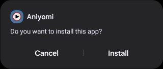

8. Once the installation is complete, you will see a prompt like this:
    
        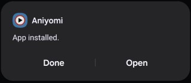
    
        Click `Open` to open Aniyomi.

9. You have now successfully installed Aniyomi on your device.


## Setting up Aniyomi


### Onboarding

1. When you first open Aniyomi, you will be greeted with the Welcome screen.

    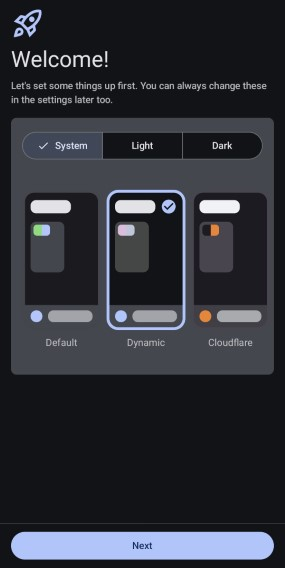

    You can choose from a variety of themes. Once you have chosen your theme, click `Next`.

2. You will now be asked to select a storage folder. This is where Aniyomi will store downloads, backups and more. 

    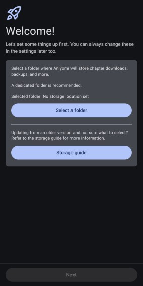

    Click `Select Folder` to choose a folder. I recommend creating a new folder called `Aniyomi` in your internal storage or SD card.
    So it should say `/storage/emulated/0/Aniyomi`

3. Once you select a folder, android will ask you to allow Aniyomi to access your storage. Click `Allow` to allow Aniyomi to access your storage.

4. Now you will be asked to grant Aniyomi the necessary permissions. 

    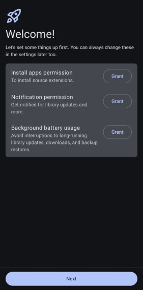

    Click `Grant` to grant Aniyomi the necessary permissions.

5. The onboarding process is now complete. Click `Get Started` to start using Aniyomi.


### Tracking

To track your anime and manga, you can make use of the various tracking services available in Aniyomi.

1. Click on the `More` tab at the bottom of the screen, then click on `Settings`.

    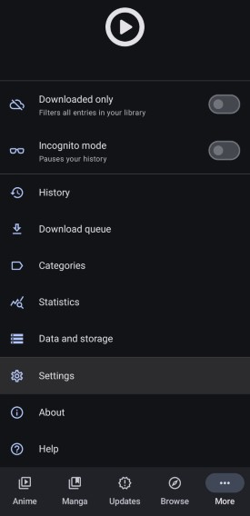

2. In the settings menu, click on `Tracking`.

3. Here, you will see a list of tracking services that you can use. Click on the service you want to use and sign in with the account for that service.


## Extensions

### Adding Repositories

The way Aniyomi works is through the use of extensions. Extensions are like plugins that allow Aniyomi to fetch anime and manga from different sources.
For example, if you had a specific anime site, you could create an extension for it and add it to Aniyomi. This extension would then fetch anime from that site and display it in Aniyomi.

We can make use of third-party extension repositories that contain community maintained extensions. These repositories contain extensions for a variety of different sites.

We will be making use of the [Kohi Den](https://github.com/Kohi-den/extensions) repository for anime and the [Keiyoushi](https://github.com/keiyoushi/extensions) repository for manga.

To add the repositories, simply click the links below:

- [Kohi Den](aniyomi://add-repo?url=https%3A%2F%2Fraw.githubusercontent.com%2Fkohi-den%2Fextensions%2Fmain%2Findex.min.json)
- [Keiyoushi](aniyomi://add-repo?url=https%3A%2F%2Fraw.githubusercontent.com%2Fkeiyoushi%2Fextensions%2Frepo%2Findex.min.json)

If the links don't work, you can add the repositories manually by following the steps below:

1. Open Aniyomi and click on the `More` tab at the bottom of the screen, then click on `Settings`.

    

2. In the settings menu, click on `Browse`

    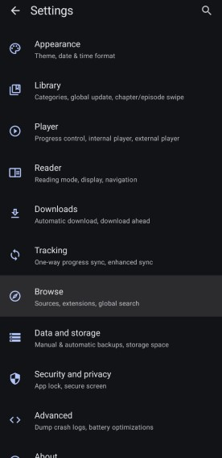


3. Here, you will see `Anime extension repos` and `Manga extension repos`. 
    Depending on which repository you want to add, click on the respective section.

    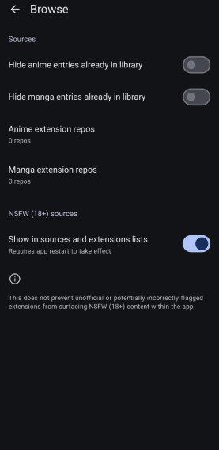

4. Click `+ Add` in the bottom right corner, and paste one of the following URLs in the text box:

    **Kohi Den (Anime):**
    ```
    https://raw.githubusercontent.com/kohi-den/extensions/main/index.min.json
    ```
    **Keiyoushi (Manga):**
    ```
    https://raw.githubusercontent.com/keiyoushi/extensions/repo/index.min.json
    ```

    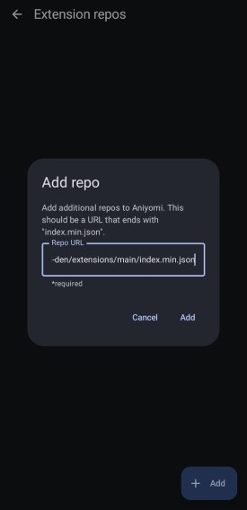

5. Click `Add` to add the repository.

Now, when you go to the `Browse` > `Anime Extensions` or `Manga Extensions` section, you will see the extensions from the repositories you added.

You can start trying out different extensions and see which one works best for you.

:::tip
Due to the nature of third-party extensions, you must click on the extension to trust it. Aniyomi will not fetch data from an extension that you have not trusted.
Each time an extension is updated, you will need to trust it again.
:::


### Torrentio

Although I am not going to recommend a specific extension, I will show you how to set up Torrentio Anime. 
This is the extension that I recommend using as I believe it is the best one available.

If you have used Stremio before, you will definitely have heard about the Torrentio addon before. 

Torrentio is a Stremio addon that returns torrent results for movies and TV shows. 
For a more detailed explanation on how Torrentio works, you can check out [this reddit comment](https://www.reddit.com/r/StremioAddons/comments/19fmjlp/comment/kjlnwru/)

Torrentio Anime is an extension that uses the Torrentio stremio addon to fetch torrent results for anime only. 

Although Aniyomi does not currently support torrent streaming, it is still possible to use Torrentio Anime to fetch torrent results for anime through using a debrid service. 
This is a paid service which I discuss below. 

If you really do not want to pay at all, you can use Kuukiyomi, a fork of Aniyomi that supports torrent streaming.
However, I still recommend reading the debrid section as it may change your mind.


#### Debrid Service 

##### What is a debrid service?

A debrid service will download torrents for users and then store them on their high speed servers. 
These torrents can then be streamed by other users through a SSL encrypted connection.

It is completely safe and secure to use a debrid service as your connection is encrypted and your IP address is not publicly shown as it would be when torrenting.

Using a debrid service will allow you to stream high quality content without buffering. 
You can stream at speeds of up to 1gbps. This means you can watch high bitrate 4K content without buffering.
Even old anime that do not have a lot of seeders, as long as the torrent is cached, you will be able to stream it without buffering (assuming your internet speed is fast enough).

You can use the debrid service for more than just Aniyomi. You can use it for any torrent or file on a supported hoster. 
This means you can download games, software, audio etc. through your debrid service. You can also set up [Stremio](../stremio) to watch movies and TV shows through your debrid service.

However, a debrid service cannot increase your internet speeds.
If your internet speed is already slow, then a debrid service will not help you stream higher quality content.
You need to have a fast internet speed yourself to capitalise on the benefits of a debrid service.

However, the drawbacks of using a debrid service are that most do not seed the torrents and will also restrict usage to one IP address at a time.
This means that you are not contributing to the torrent and that you can only use the service on one network at a time.

There are, however, some exceptions to these rules. I will go through them in the next section.


##### Which debrid service do I use?

:::info
I receive a commission (free days or small amount of money) if you sign up to a debrid service through (some of) the links provided. This is at no extra cost to you and is a way to support me.
:::

There are many debrid services available to use. Here is a list of the ones supported by Torrentio. I will walk you through the setup for each below.

- [Real Debrid](https://real-debrid.com/?id=9483829)
- [AllDebrid](https://alldebrid.com/?uid=3n8qa&lang=en)
- [Premiumize](https://www.premiumize.me/)
- [Debrid-Link](https://debrid-link.com/id/EY0JO)
- [Offcloud](https://offcloud.com/?=06202a3d)
- [Put.io](https://put.io/)
- [Torbox](https://torbox.app/subscription?referral=9ca21adb-dbcb-4fb0-9195-412a5f3519bc)

When choosing a Debrid service, the factors you have to consider are cost and the value you get from it which is made up of its optimality and userbase.

Real Debrid, AllDebrid, and Debrid-Link are the cheapest debrid services.
However, Debrid-Link and AllDebrid are the cheapest as they offer a 300 day plan compared to Real-Debrid whose maximum is 180 days.
Other than that, their prices are the same.

Optimality refers to your proximity to the service's servers. The closer you are, the faster the download speeds and thus the better the streaming experience.
The download speeds you get directly determine the quality of the stream you can watch. Make sure to carry out speed tests to determine the best service for you.
The speed tests for each debrid service can be found [here](../stremio/faq#where-can-i-find-the-speed-tests-for-debrid-services) and on their website too.

A larger userbase means more cached torrents, with Real Debrid and AllDebrid leading.
However, the other debrid services will still have a lot of popular torrents cached.

Support for debrid services varies among addons, with Real Debrid, AllDebrid, and Premiumize being the most supported.
Every debrid service except Torbox is supported by Torrentio (the most popular) and it is possible to get Torrentio streams for Torbox through MediaFusion.
Find a full table of supported debrid services [here](../stremio/faq#which-debrid-services-are-supported-by-each-addon).

I previously discussed some of the limitations of debrid services, namely the lack of seeding and the restriction to one IP address.
As I said before, there are some exceptions. I will now go through them.

**Seeding**:

:::warning
With the way debrid services work, users of debrid services will always be taking more than they are giving.

The debrid services below will seed the torrent if it hasn't been cached already. 
In the case that its already been cached, they may not seed it, and other users can stream this cached torrent too. 
:::

- Debrid-Link offers a seedbox with these limits: 600 torrents and 2.5TB of data transfer per month.
- Premiumize will seed to a 2.0 ratio or for 72 hours. Whichever comes first.
- put.io is similar to Premiumize but the exact numbers are dependent on your plan. Check their pricing page for more information.

**IP Restrictions**:

- Premiumize is the only debrid service that allows multiple IP addresses. However, it does operate on a storage limitation that you may reach depending on your usage.

:::info
All-Debrid offers a free 7-day trial and put.io offers a $0.99 1 day trial, ideal for testing its suitability.
Alternatively, you can use the 15 day package that most debrid services offer to test them out.
:::

One last piece of information to consider is that Real Debrid has gone down more than any other debrid service but it is still a small amount of downtime.

##### Setting up a debrid service

I will now cover the instructions of setting up each debrid service I previously mentioned.

<Tabs className="custom-tabs" queryString="debrid">
<TabItem value="real-debrid" label="Real Debrid"> 
    
    
    1. Go to [Real Debrid's website](https://real-debrid.com/?id=9483829)
    2. Click Sign Up to create an account
    3. Go to the Premium Offers page
    4. Choose a package and subscribe. 
</TabItem>
<TabItem value="alldebrid" label="AllDebrid">
    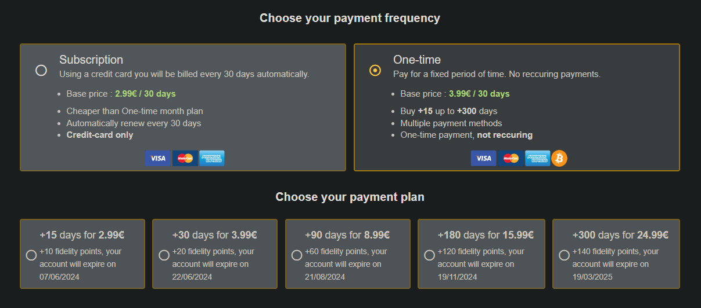
    
    1. Go to [AllDebrid's website](https://alldebrid.com/?uid=3n8qa&lang=en)
    2. Click `Create an account` at the top and register for an account. 
    3. Go to the Pricing page
    4. Choose a package and subscribe.
</TabItem>
<TabItem value="premiumize" label="Premiumize">
    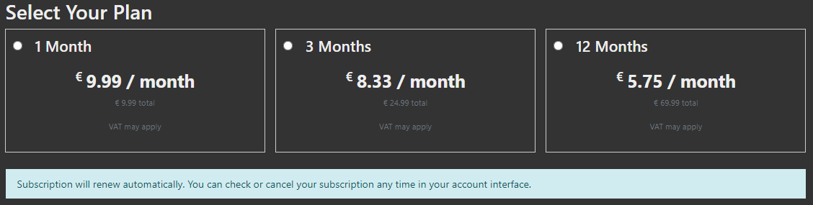

    1. Go to [Premiumize's website](https://www.premiumize.me/)
    2. Click Sign Up in the top right corner to create an account
    3. Click `Buy Premium` at the top of the page
    4. Choose a package and subscribe.

</TabItem>
<TabItem value="debrid-link" label="Debrid-Link">
    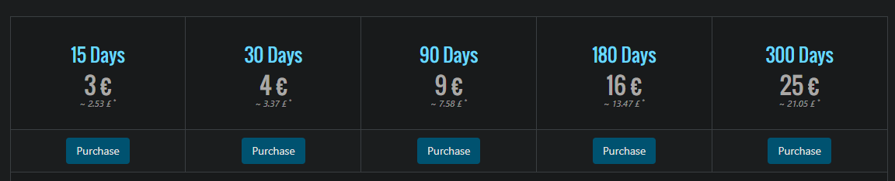

    1. Go to [Debrid-Link's website](https://debrid-link.com/id/EY0JO)
    2. Click Register in the top right corner or `Try it Free` on the home page.
    3. Fill in the required details and click `Register`
    4. Click `Premium` in the top right corner
    5. Choose a package and purchase it.

</TabItem>
<TabItem value="offcloud" label="Offcloud">
    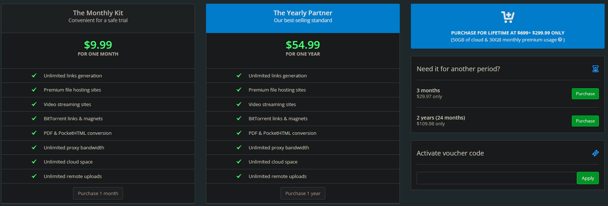

    1. Go to [Offcloud's website](https://offcloud.com/?=06202a3d)
    2. Enter your email and click `Join us for free`
    3. You will be sent an email to set your password, set your password and log in.
    4. Click `Shop` from the navigation bar on the left.
    5. Choose a package and purchase it.

</TabItem>
<TabItem value="put.io" label="put.io">
    

    1. Go to [put.io's register page](https://app.put.io/register) and create an account
    2. You will see a banner asking you to activate your account. Click the button to go to the [billing page](https://app.put.io/billing/activate-account)
    3. Choose a package and purchase it.

    <Admonition type="info">
    Put.io offers two plans for which you can either pay monthly or yearly.
    One plan gives you 100GB of storage and the other 1TB. Depending on the amount and size of files you will be streaming, choose the plan that suits you best.

    I believe that the storage is not made up of the accumulated size of all the files you have downloaded, but rather the amount of files you have downloaded and stored currently.
    You can delete files to make space for new ones.

    However, I am unsure of the accuracy of this information. If you are considering put.io, then I would recommend contacting their support or looking at their FAQ.
    </Admonition>

</TabItem>
</Tabs>

#### Installing Torrentio Anime

I will be using the Torrentio Anime extension from the Kohi Den repository.

1. Go to the `Browse` > `Anime Extensions` section in Aniyomi, and search for `Torrentio Anime`.

    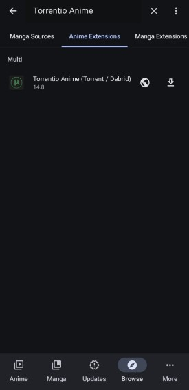

2. Click the download button to install the extension.

3. Once the extension is installed, click on the settings icon to configure the extension.

4. Then click on the settings icon again next to `Multi` to configure it.

    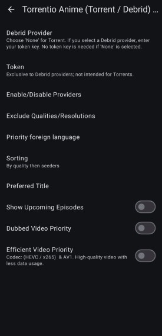

- `Debrid Provider` - Choose your debrid provider from the list.

- `Token` - Enter your debrid service's API key here. 

<details>
<summary>Where can I find my debrid API key?</summary>
<div>

<Tabs queryString="debrid">
<TabItem value="real-debrid" label="Real Debrid">

1. Go to [apitoken page on RealDebrid](https://real-debrid.com/apitoken)
2. Your API key will be displayed on this page. Highlight it all and press `Ctrl + C` to copy it.

</TabItem>
<TabItem value="alldebrid" label="AllDebrid">

1. Go to the [apikeys page on AllDebrid](https://alldebrid.com/apikeys)
2. Enter a name to identify the API key and press `Create`
3. Below the name you entered, you will see the API key. Highlight it all and press `Ctrl + C` to copy it.

</TabItem>
<TabItem value="premiumize" label="Premiumize">

1. Go to the [account page on Premiumize](https://www.premiumize.me/account)
2. Under the `Account Data` section, you will see `API Key`. Press `Show API Key`
3. The API Key will now be displayed above the button. Highlight it all and press `Ctrl + C` to copy it.

</TabItem>

<TabItem value="debrid-link" label="Debrid-Link">

1. Go to the [API Key page on Debrid-Link](https://debrid-link.fr/webapp/apikey)
2. Click `Reveal Key`
3. Confirm your password
4. Your API key will be displayed. Press the `Copy` button to copy it.

</TabItem>
<TabItem value="offcloud" label="Offcloud">

1. Go to [your account page](https://offcloud.com/#/account) on Offcloud
2. Click `API` on the left side of the page
3. Your API key will be displayed. Press the `Copy` button to copy it.

</TabItem>

<TabItem value="put-io" label="Put.io">

1. Go to the [API page](https://app.put.io/oauth) on Put.io
2. Click `Create App`
3. Fill in the required information and click `Create App`
   :::tip
   You can use any information for the app name and description. It does not have to be accurate.
   :::
4. You will be shown 3 fields - `Client ID`, `Client Secret` and `OAuth token`. For Torrentio, you need both the `Client ID` and `OAuth token`. You can press the clipboard icon to copy the value.

</TabItem>
</Tabs>
</div>
</details>

- `Enable/Disable Providers` - Here, you can choose the different providers that Torrentio will fetch torrents from. You can enable or disable them by clicking on them. I recommend enabling all of them for the most results.

- `Exclude Qualties/Resolutions` - You can choose to exclude certain qualities from the search results. Since we are on mobile where your phone most likely doesn't support 4K, I recommend excluding the following qualities:
    - HDR/HDR10+/Dolby Vision
    - Dolby Vision
    - 4k
    - Screener
    - CAM

- `Priority Foreign Language` - Here, you can choose the language you want your results to have. I recommmend leaving this blank.

- `Sorting` - You can choose how you want your results to be sorted. I recommend `By quality then size`. Usually, the higher the size the better the quality, so this will give you the best quality results.

- `Preferred Title` - Here, you can choose the title you want your results to have. This is completely preference, but I prefer the English title.
    - Romaji - Shingei no Kyojin
    - English - Attack on Titan
    - Native - 進撃の巨人

- `Show upcoming episodes` - If enabled, this will show unaired episodes in the episode list for an anime. I recommend keeping this disabled.

- `Dubbed video Priority` - If enabled, dubbed videos will be shown first in the results. If you prefer dubbed anime, enable this.

- `Efficient Video Priority` - If enabled, videos that are more efficient to stream will be shown first in the results. If you have a slow internet connection, or limited data, you may want to enable this.


Once you have configured the settings, restart Aniyomi to apply the changes.

:::tip
I recommend pinning the Torrentio Anime source. This is because Aniyomi will only search for sources from pinned sources, at first. 

To pin the Torrentio Anime source, click on `Browse`, then `Anime Sources`, then click on the pin icon next to `Torrentio Anime`.
:::


## Using Aniyomi


There are 5 main sections in Aniyomi:

- Anime: This is your Anime library where you can find all the anime you have added to your library.
- Manga: This is your Manga library where you can find all the manga you have added to your library.
- Updates: Whenever the extension for the anime/manga in your library has a new episode/chapter, it will show up here.
- Browse: This is where you can browse for new anime and manga to add to your library.
- More: This is where you can find additional menus like settings, history, statistics, backups and more. 


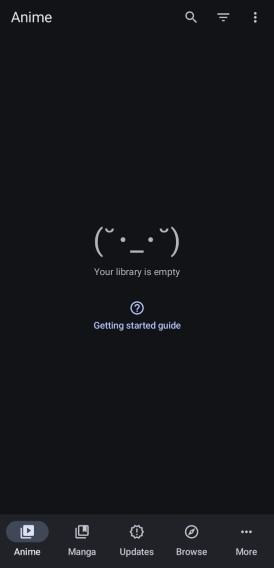

### Adding Anime to your Library

To add anime to your library, you can either do a global search by pressing the globe icon in the top right corner of the `Browse` tab, or you can click on a specific anime source and search for anime there.

Once you find the anime you want to add to your library, click on it to open the page for that anime.

You can then click `Add to Library` to add the anime to your library, or `Tracking` to enable your tracking services for that anime. 

You can pull down on the screen to refresh the page and check for new episodes.


### Watching Anime

To watch anime, within the page for the anime you want to watch, click on the episode you want to watch.

You will then open the player. The episode will start playing automatically.

To change servers/links, subtitles, and audio, click on the player icon with a setting cog in the top right corner of the player.


