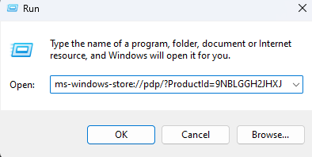
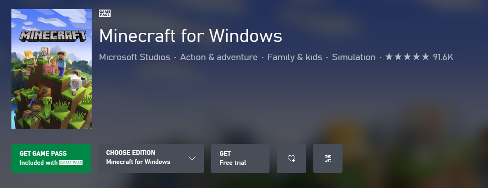
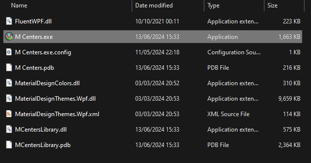
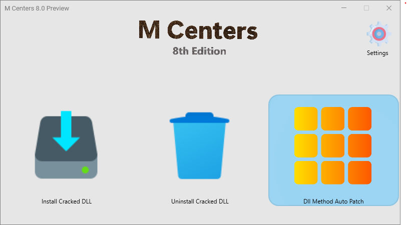
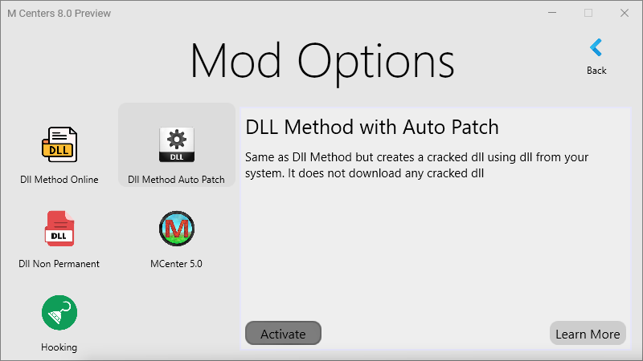

# Windows

For windows, we will make use of an application called M Centers. 

:::note
I do not own or have any affiliation with M Centers. I am simply providing a link to their website.
:::

## Obtaining Minecraft


1. Open Microsoft Store and ensure you are signed in to a microsoft account. Also log into your microsoft account on the Xbox app. Then close both apps

2.  Press the Windows key and R and copy and paste the following into the run dialog box and press enter: 
    ```
    ms-windows-store://pdp/?ProductId=9NBLGGH2JHXJ
    ```
    

3. It should open up Minecraft in the Microsoft store. Get the trial version of the game and wait for it to complete downloading.
    :::warning
    Do not open the game yet
    :::
    

## Using M Centers

4. Download [M Centers 8.0](https://mcenters.net/Downloads/M-Centers-8th-Edition/).

5. Extract the zip file and double click the EXE file: 
    

6. Click on the grid button that says `Dll method online`. 
    

7. Click `Dll Method Auto Patch` and then click Activate. 
    

8. Click back to go back to the home screen 

9. Click Install Cracked Dll and wait for it to complete

10. Launch minecraft through windows search