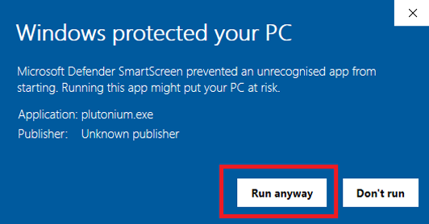

# Plutonium Launcher

1. Download [plutonium.exe](https://cdn.plutonium.pw/updater/plutonium.exe) 

You can save the launcher anywhere you want, somewhere convenient such as your desktop or the game folder 

2. Open the launcher. If Windows Defender comes up, click **More info**, then **run anyways** 

The launcher will now start the process of installing the client files. 

3. Enter your forum credentials to login, if you dont have a forum account, create one [here](https://forum.plutonium.pw/register)

4. Now setup the game you want to play.
