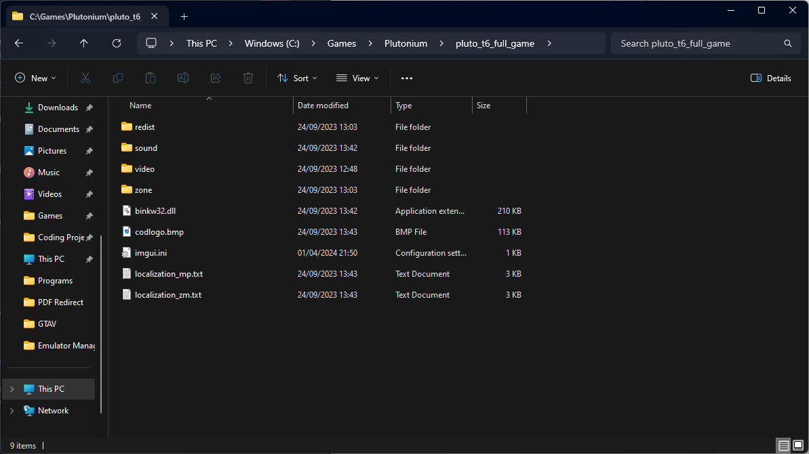

# Downloading the base game

:::danger 
Torrenting copyright protected files might not be legal in your country even if you already own a valid license! We are not responsible for any legal issues and recommend you to use a VPN.
:::
1. Download and open your favourite torrent software. [qBittorrent](<https://www.fosshub.com/qBittorrent.html>) is recommended

2. Download the torrent file for the game you want:

* [T6 - Black Ops 2](https://web.archive.org/web/20230128083145/https://plutonium.pw/pluto_t6_full_game.torrent)
* [T5 - Black Ops 1](https://web.archive.org/web/20230128083145/https://plutonium.pw/pluto_t5_full_game.torrent)
* [T4 - World at War](https://web.archive.org/web/20230128083145/https://plutonium.pw/pluto_t4_full_game.torrent)

3. Open the torrent file and it will open up in your torrent software and ask you where to save the torrent file. Save it in a suitable location such as `C:/Games/Plutonium`.

4. Start the download and wait till the download completes you will know it's done when the progress changes to 100% and the status changes to Seeding.

**Once it says Seeding, you can delete it from qBittorrent.**

Once it's done you will have your copy of the game downloaded, here is an example of a completed base game folder:

---

