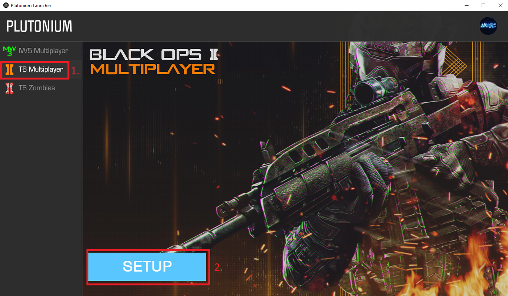
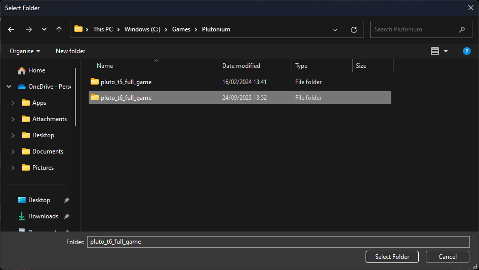

# Setting it up with the Plutonium Launcher 

1. Navigate to the game you want to play (e.g Black Ops II - T6 Multiplayer/T6 Zombies) and click SETUP

2. Find and select the game folder, e.g pluto_t6_full_game

:::info
You do not need to setup Multiplayer and Zombies separately, setting up one of them automatically sets up the other
:::

(If you ever need to reselect the game folder, simply click on Game Settings next to the PLAY button)

Congratulations! You have completed the installation guide.

To launch the game simply open the Plutonium launcher and select PLAY on the game you want to play.
