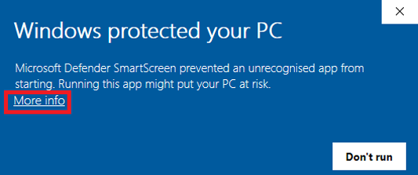
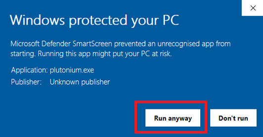
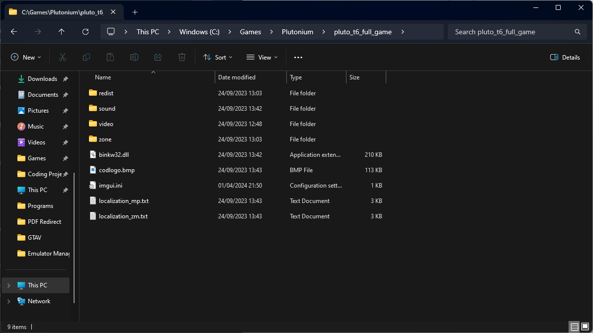

# Plutonium

This guide will show you how to setup Plutonium on your Windows device. Plutonium allows you to play Call of Duty: Black Ops I, II and World at War. 

You will be able to play these games for **free**.

## What is it 

Plutonium offers a unique Black Ops 1, Black Ops 2, Modern Warfare 3 & World at War experience, complete with dedicated servers, mod support, and much much more. The entire modification is provided for **free** and it supports **pirated copies** too.

(It also supports [Guitar Hero 3 (III)](https://forum.plutonium.pw/topic/29272/plutonium-gh3-ghwt) and [007 - Quantam of Solace (7)](https://forum.plutonium.pw/topic/35403/plutonium-quantum-of-solace) that came about as April Fools that appeared to hint at Black Ops 3 / T7) 

This guide will cover the instructions for installing T4, T5 and T6. For IW5, please see the [official docs](https://plutonium.pw/docs/install/#iw5-modern-warfare-3)

## Plutonium Launcher

1. Download [plutonium.exe](https://cdn.plutonium.pw/updater/plutonium.exe) 

You can save the launcher anywhere you want, somewhere convenient such as your desktop or the game folder 

2. Open the launcher. If Windows Defender comes up, click **More info**, then **run anyways** 

The launcher will now start the process of installing the client files. 

3. Enter your forum credentials to login, if you dont have a forum account, create one [here](https://forum.plutonium.pw/register)

4. Now setup the game you want to play.

## Downloading the base game

:::danger 
Torrenting copyright protected files might not be legal in your country even if you already own a valid license! We are not responsible for any legal issues and recommend you to use a VPN.
:::
1. Download and open your favourite torrent software. [qBittorrent](<https://www.fosshub.com/qBittorrent.html>) is recommended

2. Download the torrent file for the game you want:

* [T6 - Black Ops 2](https://web.archive.org/web/20230128083145/https://plutonium.pw/pluto_t6_full_game.torrent)
* [T5 - Black Ops 1](https://web.archive.org/web/20230128083145/https://plutonium.pw/pluto_t5_full_game.torrent)
* [T4 - World at War](https://web.archive.org/web/20230128083145/https://plutonium.pw/pluto_t4_full_game.torrent)

3. Open the torrent file and it will open up in your torrent software and ask you where to save the torrent file. Save it in a suitable location such as `C:/Games/Plutonium`.

4. Start the download and wait till the download completes you will know it's done when the progress changes to 100% and the status changes to Seeding.

**Once it says Seeding, you can delete it from qBittorrent.**

Once it's done you will have your copy of the game downloaded, here is an example of a completed base game folder:

---

## Setting it up with the Plutonium Launcher 

1. Navigate to the game you want to play (e.g Black Ops II - T6 Multiplayer/T6 Zombies) and click SETUP

2. Find and select the game folder, e.g pluto_t6_full_game

:::info
You do not need to setup Multiplayer and Zombies separately, setting up one of them automatically sets up the other
:::

(If you ever need to reselect the game folder, simply click on Game Settings next to the PLAY button)

Congratulations! You have completed the installation guide.

To launch the game simply open the Plutonium launcher and select PLAY on the game you want to play.

## Credits

This guide is a slightly modified version of the original guides by [Plutonium](https://plutonium.pw/docs/install/)
