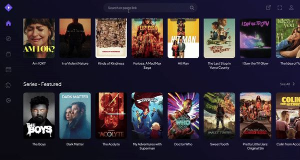

# Introduction

## What is Stremio?

Stremio, on its surface, is a simple media player and aggregator. 
When combined with the right addons and a debrid service though, it becomes my favourite on-demand video streamer currently in existence. 
Following this guide, you'll have a simple yet aesthetically pleasing app that will combine Netflix, Hulu, Disney+, HBO Max, Amazon Prime, Apple TV+, and so much more all in one unified app, with the potential for unlimited and unrestricted 4K content.

Stremio itself is free to download and use, though the debrid part of this service costs a small amount of money (£2.53/15 days or £13.47 / 6 months (£2.30/month)). 
The benefits of a debrid service and why it is so highly recommended are explained in [Debrid Services](technical-details#debrid-services). 
It is not, however, required.

Stremio supports many devices, here is a list of supported devices:

- Android
- PC (Windows/Mac/Linux)
- Android TV
- Samsung TV (2019+ Models)
- LG TV (2020+ Models)
- Amazon Fire Devices (Requires sideloading)
- iOS (workarounds needed)

You can also use Stremio without installing any application from your browser at [Stremio Web](https://web.stremio.com/).

I will now go through the technical details of Stremio, debrid services and addons. If you do not care for these details, please skip ahead to the [guide](guide).
## Showcase 

Here is a short video showing the UI of Stremio: 

## Why should I use it over a movie website

- Your website does not support 4k
- The 1080p content available through Stremio is vastly superior to the low bitrate and compressed content shown on your movie website
- With a Debrid service, you will not experience buffering (with a good internet)
- As soon as digital copies are available, you will be able to watch it through Stremio.
- Stremio can be directly installed onto many devices and there are no ads.

