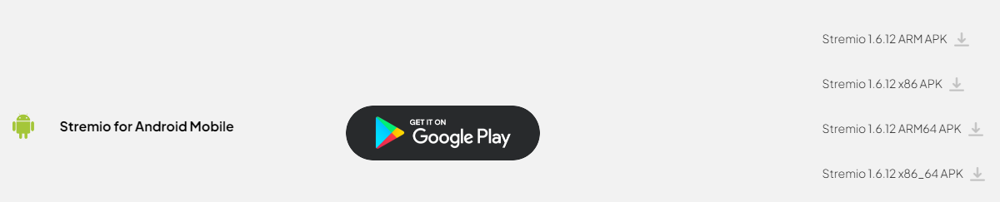
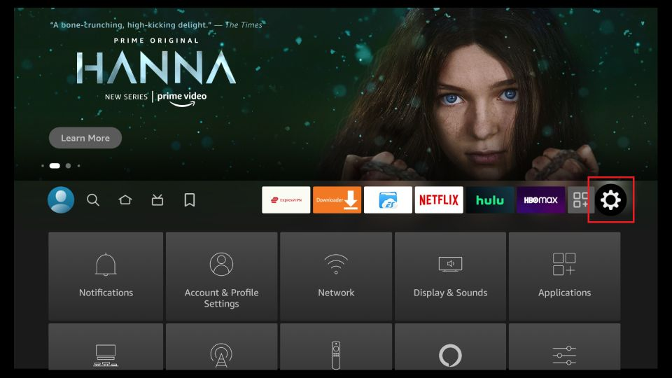

import Tabs from '@theme/Tabs';
import TabItem from '@theme/TabItem';
import Admonition from '@theme/Admonition';

# Guide
I will now begin the guide to setting up Stremio and its addons. I recommend that the initial setup is completed on your laptop or desktop. Once it has been setup, you can log in to Stremio with the same account on any device and your configuration will be synced to the device so there is no need to set it up again.

## Creating a Stremio Account

First, we need to create a Stremio account. This allows you to keep your progress on different content synced across devices and also allows you to sync your configuration so that it does not need to be repeated.

Head over to [Stremio](https://stremio.com/) and either [sign up for an account](https://www.stremio.com/register) with an email or [login](https://stremio.com/login) through Facebook.

## Downloading Stremio
Head to the [downloads page](https://stremio.com/downloads) and download the required package.

If you can't find the download link for your device, I will go through the instructions for each device here.
<Tabs>
<TabItem value="pc" label="PC" default>

    For windows, download the following: 

    

    For Mac OS, download one of the following depending on your version of Mac OS:

    

    For Linux, download one of the following:
    
    

    There are packages available for popular distributions of Linux such as Debian and Arch Linux. However, there is also a flatpak link as well as a link to the source code. 

    The flatpak can be used to install Stremio on the Steam Deck too. 

</TabItem>
<TabItem value="android" label="Android">
    
    Stremio can be installed from the [Play Store](https://play.google.com/store/apps/details?id=com.stremio.one).

    However, you can also download one of the following:

    

    You will most likely need to download the ARM64 APK.

    - ARM (armeabi-v7a) - 32 bit 
    - ARM64 (arm64-v8a) - 64 bit 
    - x86 - 32 bit Intel 
    - x86_64 - 64 bit Intel

</TabItem>
    <TabItem value="ios" label="iOS">

    There is a basic version of Stremio available on the App Store.

    For a better experience, you can follow this [blog post](https://blog.stremio.com/using-stremio-web-on-iphone-ipad/). It shows you how to set up a PWA (Progressive Web App). This will give you access to all of Stremio's features.

    Because of some restrictions on iOS, a debrid service is highly recommended. This is needed because iOS does not support torrent streaming.

    If you pay for a debrid service, you should not have any problems. But, you will need to follow the instructions in the blog post above to get the full Stremio app on your iOS device.

</TabItem>
<TabItem value="amazon" label="Fire Devices">

    Stremio is not available on the amazon app store. To install Stremio, you will need to sideload the app. 
    
    I will now go through the steps to sideload the app. (Source: https://www.firesticktricks.com/sideload-apps-on-firestick.html)

    1. In the home screen, click on the search icon to access the find menu. 

    2. Search for Downloader 

    3. Click on the `Downloader` app and then click get/download.

        

    4. Navigate to the settings menu from the home screen 

        

    5. Scroll down to `My Fire TV` and click it 

    6. If you see the `Developer Options` setting under `About`, skip to step 10.

    7. Click `About`

    8. Click `Fire TV Stick Lite/4K/4K MAX` 7 times quickly. 

    9. You should then see a message saying `No need, you are already a developer` 

    10. Go back to the My Fire TV menu and click Developer Options

    11. You will see either `Install apps from unknown sources`, in which case you select that, and turn it ON. 

        Otherwise, you will see `Install unknown apps`. Select this, navigate to Downloader, and turn it ON.

    12. Go back to the home screen. Scroll to the end and click on the apps menu. Click on `My Apps`

        

    13. Select the Downloader app. 

    14. Click `Allow` if it asks for permission to access storage 

    15. Navigate to the Downloader settings and enable JavaScript

    16. Click `Browser` on the sidebar. 

    17. Enter the following URL in the searchbar `https://stremio.com/downloads` and click `Go`

    18. On the stremio website, scroll down to the android TV section and click the following link:
    
        

    19. The download should automatically start. When the Android installation prompt shows, click `Install` 

    20. When the install is finished, click Done. 

    21. When you click Done, a pop-up will appear on the Downloader app. You can click `Delete` to remove the APK file. This won't delete the app. 

    22. Stremio should now be installed to your Fire Stick. Launch Stremio from the same place you launched the downloader app from. 

    <Admonition type="info">
    You can also move Stremio to the top so that you can launch it directly from the home screen
    </Admonition>

</TabItem>
<TabItem value="android-tv" label="Android TV">
    
        Stremio can be installed from the [Play Store](https://play.google.com/store/apps/details?id=com.stremio.one).
    
        However, you can also download one of the following:
    
        
    
        You will most likely need to download the ARM APK.

        - ARM (armeabi-v7a) - 32 bit 
        - ARM64 (arm64-v8a) - 64 bit 
        - x86 - 32 bit Intel 
        - x86_64 - 64 bit Intel

</TabItem>
    <TabItem value="samsung" label="Samsung TVs">
    
    Search for Stremio in the App Store of 2019+ Samsung TV models

</TabItem>
    <TabItem value="lg" label="LG TVs">    

    Search for Stremio in the App Store of 2020+ LG TV models. 
    <Admonition type="note">
    Stremio may not appear in the search results. However, if you go to the enterntainment section of the app store. You should see Stremio
    </Admonition>

</TabItem>
</Tabs>
Then login to Stremio using the account you created earlier.

## Debrid Service (Optional)

As explained before, a debrid service is not required. However, it removes the need for a VPN and removes the reliance on seeders for torrents by streaming from their servers at unrestricted speeds through HTTP which makes playing 4K content easy. For more details, please see [Debrid Services](technical-details#debrid-services) and the [FAQ](faq). 

Furthermore, a debrid service can be used to generate direct download links for any torrents such as games, software, music etc. without the need for a VPN as the torrenting is done by the debrid service.

### Which debrid service do I use?

There are many debrid services available to use. I will provide a tutorial for setting up Real Debrid and AllDebrid below but the setup for others will be very similar.

Here is a list of some other debrid services:
- [Premiumize](https://www.premiumize.me/)
- [Debrid-Link](https://debrid-link.com/)
- [Offcloud](https://offcloud.com/)
- [Put.io](https://put.io/)

The main factors to consider are cost and optimality. The two options that provide the greatest cost-value benefit are Real Debrid and AllDebrid. They are priced at the same point and the larger userbase ensures more torrents are regularly cached.
The average monthly cost for Real Debrid and AllDebrid comes down to around £2.30 if you get the 6-month subscription.

What I mean by optimality is how close you are to the servers of the Debrid service. The closer you are, the higher download speeds you will get from a Debrid Service. 

You can use these speed tests to test the speed (You may need to create an account before being able to test your speeds):
- [Real Debrid](https://real-debrid.com/speedtest)
- [AllDebrid](https://alldebrid.com/speedtest)
- [Premiumize](https://www.premiumize.me/speedtest)

One other factor to consider is whether streaming from multiple IP addresses is important to you. Most of these Debrid services will only allow you to use their service from one IP address at a time. This means you can use it from an unlimited number of devices from any one IP address at a given time. You cannot, for example, use it on your mobile data while another device in your home uses your home network to use the debrid service. 

**If you do use 2 IP addresses at a given time, you risk having your account banned.**

If streaming from multiple IP addresses is important to you, then consider getting Premiumize as it allows multiple IP addresses. It does, however, set a limit on the storage of files you can have in your cloud storage.

:::info
All-Debrid does provide a free 7 day trial. If you are not sure that this is the right choice for you, I suggest that you use this 7 day trial to test it out. You can also buy the service for 15 days which will cost a small amount but can be used to test it out.
:::

I will now cover the instructions of setting up a Debrid Service. I will only cover setting up Real Debrid and AllDebrid.

<Tabs>
<TabItem value="real-debrid" label="Real Debrid"> 
    
    
    1. Go to [https://real-debrid.com/](https://real-debrid.com/) (Consider using [this affiliate link](http://real-debrid.com/?id=9483829) instead to support me)
    2. Click Sign Up to create an account
    3. Go to the Premium Offers page
    4. Choose a package and subscribe. I would recommend using Amazon Pay. Using your bank card is also secure but Amazon Pay is convenient if you already have a payment method setup there. 
</TabItem>
<TabItem value="all-debrid" label="AllDebrid">
    
    
    1. Go to [https://alldebrid.com/](https://alldebrid.com/register/) (Consider using [this affiliate link](https://alldebrid.com/?uid=3n8qa&lang=en) to support me)
    2. Register for an account
    3. Go to the Pricing page
    4. Choose a package and subscribe.
</TabItem>
</Tabs>

## Setting up Addons

Addons can not be configured on some systems such as the Samsung TV app. You will have to configure the addons on your phone or desktop.

There are a plethora of addons available for Stremio. I will go through the popular addons and configuring them. 

As addons are community provided, the addons provided here may become outdated or superseded by new ones. Use this [community hosted addon list](https://stremio-addons.netlify.app/) to view all the available addons. This list will have more addons listed than the ones shown in the Stremio app.

Before this, we need to go through some of the pre-installed addons.

:::info
You may encounter issues attempting to install addons on iOS. When installing addons, you may need to copy the URL of the install button and paste that URL into the Stremio search bar to install the addon. 

To avoid these issues, you should complete the initial setup on another device
:::

### Removing pre-installed addons

The first picture above shows that when you click on a movie, Stremio will display links to third party streaming services that provide the selected content. The addon that does this is called WatchHub. 

The second picture shows catalogues from two different addons - YouTube and Public Domain Movies. The YouTube addon will show popular YouTube channels and allow you to view their latest videos. The Public Domain Movies addon will show movies that are now in the [Public Domain](https://en.wikipedia.org/wiki/Public_domain). Most of these movies are quite old and released in the 1900s. 

These addons are not required so it is recommended that they be removed. If, however, you prefer to keep them, then you may do so.

To remove these addons, go to the addons page (the puzzle icon on the navigation menu on the left of the screen) and click Uninstall on the following addons.

### Stream Provider Addons

These addons are the backbone to our on-demand streaming experience. They provide the video content that allows us to watch anything we want.

Torrentio is the most popular addon and should be all that you need for all your content. However, it is not harmful to have backups installed.

Many of the alternative addons will be hosted on [ElfHosted](https://elfhosted.com/). Although you have to pay for private instances of the addon, they provide free instances with a reasonable rate limit. Through casual viewing, these rate limits are unlikely to be hit and they are only in place to protect ElfHosted from people using automation.

I will only provide detailed instructions for Torrentio and KnightCrawler. Other addons will follow a similar structure to setting up. Ensure that any option relating to direct torrenting is disabled if you do not want to torrent and customise the addon as you wish.

    
Torrentio

    

    
    (For a in depth explanation of how Torrentio works, see [this reddit comment](https://www.reddit.com/r/StremioAddons/comments/19fmjlp/comment/kjlnwru/).)
    
    To begin, head over to [Torrentio's config page](https://torrentio.strem.fun/configure) to manage the addon.
    
    Torrentio has a lot of options and it can be overwhelming at first. Below I've listed my recommendations and my personal configuration:
    
    
    
    - `Providers`: I have them all checked excluding foreign languages.
    - `Sorting`: By quality then size. If you are not using a debrid service, then do By quality then seeders . This is because without a debrid service you are reliant on the number of seeders. However, with a debrid service the number of seeders is irrelevant to you.
    - `Priority foreign language`: Torrentio defaults to pulling English audio content regardless of origin source, so only change this if you prefer another language to display first.
    - `Exclude qualities`: If checked, the quality types selected will be excluded and suppressed from your search results. I only exclude *screener, CAM* and *Unknown* sources, therefore the only boxes I have checked are *screener, CAM* and *Unknown*. If you have slower internet or your devices aren’t capable of playing 4k content, you may want to exclude 4K sources.
    - `Max results per quality`: I leave this blank to obtain all results.
    - `Debrid provider`: Choose your Debrid provider if you are using one. If not, skip the rest of the options.
    - `API Key`: Click *here*. This link will take you to your debrid provider's website where you can obtain your API key. Copy that and paste it here.
    - `Debrid options`
        - `Don't show download to debrid`: These links will be displayed with a [RD Download] in front of them. These are torrents that were found but not downloaded to the Debrid’s servers. Clicking this link sends a request to your Debrid provider to start downloading that torrent. Clicking it poses no risk to you. I leave this unchecked.
        - `Don't show debrid catalog`: This will show a catalogue showing the videos you have watched before using your Debrid provider. I check this box as it is unnecessary clutter.
        - `Show P2P torrent links for uncached` :  If checked, this will show links to stream torrents directly. There is almost no point to leaving this checked as it poses a risk to you if not in a third world country that doesn’t care about piracy. I have this unchecked.
    
    Now we are done configuring Torrentio. The next step is to click `Install`. Doing so should automatically open Stremio prompting you to install once again.
    

    
 KnightCrawler (ElfHosted)

    

    KnightCrawler is a fork of Torrentio and the setup for it is almost the same.
    
    To begin, head over to [KnightCrawler’s config page](https://knightcrawler.elfhosted.com/configure)
    
    
    
    - `Sorting`: By quality then size. If you are not using a debrid service, then do By quality then seeders . This is because without a debrid service you are reliant on the number of seeders. However, with a debrid service the number of seeders is irrelevant to you.
    - `Priority foreign language`: Torrentio defaults to pulling English audio content regardless of origin source, so only change this if you prefer another language to display first.
    - `Exclude qualities`: If checked, the quality types selected will be excluded and suppressed from your search results. I only exclude *screener, CAM* and *Unknown* sources, therefore the only boxes I have checked are *screener, CAM* and *Unknown*. If you have slower internet or your devices aren’t capable of playing 4k content, you may want to exclude 4K sources.
    - `Max results per quality`: I leave this blank to obtain all results.
    - `Debrid provider`: Choose your Debrid provider if you are using one. If not, skip the rest of the options
    - `API Key`: Click *here*. This link will take you to your debrid provider where you can obtain your API key. Copy that and paste it here.
    - `Debrid options`
        - `Don't show download to debrid`: These links will be displayed with a [Debrid Download] in front of them. These are torrents that were found but not downloaded to the Debrid's servers. Clicking this link sends a request to your Debrid provider to start downloading that torrent. Clicking it poses no risk to you. I leave this unchecked.
        - `Don't show debrid catalog`: This will show a catalogue showing the videos you have watched before using your Debrid provider. I check this box as it is unnecessary clutter.
        - `Show P2P torrent links for uncached` :  If checked, this will show links to stream torrents directly. There is almost no point to leaving this checked as it poses a risk to you if not in a third world country that doesn’t care about piracy. I have this unchecked.
    
    Now we are done configuring KnightCrawler. The next step is to click `INSTALL`. Doing so should automatically open Stremio prompting you to install once again. Click Install again and the addon should be installed.
    

Here is a list of other addons that use torrent streams with debrid support. These may also have additional features and provide more content in some scenarios.:

- [Stremio-Jackett](https://stremio-jackett.elfhosted.com/configure)
- [Jackettio](https://jackettio.elfhosted.com/configure)
- [MediaFusion](https://mediafusion.elfhosted.com/configure) (supports live streams)
- [Annatar](https://annatar.elfhosted.com/configure) 
- [Orion](https://orionoid.com/) 

If you do not want to use a debrid service or a torrent addon, you can use HTTP addons. These addons will provide links to stream content from third party sources. The speeds will be slower than torrents and you may encounter buffering.
Here is a list of some HTTP addons:
- [JaMovies](https://eja-addon.vercel.app/) (Only 1 stream but provides 1080p links from VidSrc)
- [Shluflix](https://shluflix.elfhosted.com/configure)

For more addons, please see the [community hosted addon list with the http filter](https://stremio-addons.netlify.app/?label=http-streams)

The basic setup for Stremio has now been completed. If you search for a specific movie and click on it, you should see links to stream the selected movie with [RD/AD +] in its name. You could theoretically stop now. The next few addons I will go through are optional addons such as subtitle addons or addons that mainly focus on giving you an experience more like streaming services by populating your Home page with popular/new/trending movies or other content of your liking.

### Catalogue Addons

These are the addons that provide categories for your Stremio homepage. It'll pull, for example, `Netflix movies popular`, `Netflix movies new`, `Netflix series popular`, `Netflix series new`, etc. to create a semi-endless scrolling experience that pulls all of the best and newest that film and TV have to offer, and everything else in between. 

Note that Stremio will display the catalogues from the addons in the order that they were installed. Therefore, install the catalogue addons in the order you want them to appear on your homepage. However, the order can be changed through an external addon manager. I will go through this in the Extras section.

There is one built-in addon called Cinemata which provides Popular and Featured Movies and Series. If you feel that Cinemata is enough then you do not need to install any others. However, it is recommended that you at least try them out and see what the addons do.

I will go through the most popular addons that are used currently. However, be sure to look through the Community addons on Stremio and on the community hosted website I linked earlier as there are always new addons being created. 

:::note
CyberFlix and Streaming Catalogs are very similar and will show very similar content. I recommend that you only install one of them
:::

:::note
For those looking to watch anime on android specifically, I would recommend using [Aniyomi](../category/aniyomi) (An android only app) instead, it has a much greater library of HTTP addons and also supports Torrentio (debrid required). It supports tracking with AniList, MyAnimeList, Trakt, Kitsu and more. It also has an AniSkip feature which allows you to skip intros. As an app built for anime, I feel it is a much better choice. 
The lack of syncing on Stremio is also a factor to think about. The animeo addon does allow syncing, however it only supports AniList and it updates AniList when you start watching an episode. animeo may support more tracking services in the future. 
:::

TMDB Addon

    

    
    The TMDB addon that will fetch data from The Movie Database to display Popular and New Movies and Series. 
    
    
    
    1. Head to the [TMDB Addon Configuration page](https://94c8cb9f702d-tmdb-addon.baby-beamup.club/configure)
    2. Configure the catalogue settings to your liking. (The ratings on poster is not required)
    3. Select your language.
    4. Click Install. 
    5. Stremio should now open and a prompt asking you to install should appear, click Install again.
    
    
    
    The addon should now be installed.
    

IMDB Catalogs

    

    This addon will add a catalogue that fetches movies and shows from IMDB. This addon requires no configuration, so it can be installed from directly within the Stremio app. 
    
    1. Head to the addons page on the Stremio app
    2. Click on the Community Addons tab
    3. Search for `IMDB Catalog` and it should be the first result. 
    4. Click Install.
    

CyberFlix

    

    
    This Addon will fetch a list of movies from a range of different 3rd party streaming services as well as different catalogs for Kids, Anime, and Indian Movies. (It is recommended that you use the Kitsu Addon for Anime instead)
    
    To get started, head over to the [configuration page](https://cyberflix.elfhosted.com/)
    
    
    
    1. Click Setup
    2. Select up to 60 different catalogues to display on your homepage. Click the arrows to select/deselect specific types of catalogues for a streaming service.
    3. Click Next
    4. Rearrange the order of the catalogues to your liking and click Next again
    5. Then click Install on Stremio and a prompt should open in the Stremio app. Click Install on that prompt too.
    

Streaming Catalogs

    

    
    This addon is very similar to CyberFlix. It only provides 2 catalogues for each streaming service instead of 4.
    
    1. Head over to the [Streaming Catalogs Configuration page](https://7a82163c306e-stremio-netflix-catalog-addon.baby-beamup.club/)
    2. Click on the filter providers by country and select Any.
    3. Select the streaming services that you want to see in your home page for Stremio.
    4. Click Install addon and then when the Stremio app opens with a prompt asking to install, click Install again.
    

Kitsu

    

    
    This addon is focused on providing catalogues for Anime. It provides Top Airing, Trending, Most Popular, Highest Rated, and Newest. It is recommended to use this addon for anime as you are more likely to get stream results with the metadata from the Kitsu addon.
    
    Similar to the IMDB Catalogs addon, this addon cannot be configured. I could not find the addon through the built in community addon search so I will go through the steps for installing an addon through the search bar.
    
    1. Copy this URL: [https://anime-kitsu.strem.fun/manifest.json](https://anime-kitsu.strem.fun/manifest.json)
    2. In the stremio application, paste the URL into any search bar. (main one or addon search bar). 
    3. A prompt should show giving you the option to install this addon. 
    
    You may also configure the [Anime Catalogs addon](https://1fe84bc728af-stremio-anime-catalogs.baby-beamup.club/configure) too.
    

### Subtitle Addons

Here are a list of working subtitle addons. This list may become outdated, please check the community addons list for new subtitle addons if none of these work.

- [Official OpenSubtitles v3](https://opensubtitles-v3.strem.io/)
- [SubDL](https://stremio-subdl.vercel.app/configure)
- [yifysubtitles by dexter21767](https://2ecbbd610840-yifysubtitles.baby-beamup.club/configure/)
- [Subscene - Reborn (UFO)](https://subscene.stremio.homes/)
- [OpenSubtitles (UFO)](https://opensubtitles.stremio.homes/)
- [MSubtitles](https://msubtitles.lowlevel1989.click/conf/api/v1/configure) (You need to add subtitles on the website)
- Legendasdivx - Addons for PT-PT and PT-BR. Must be registered. https://www.legendasdivx.pt/

## Using Trakt

The previous addons provide a good experience for most users. However, they only provide content from streaming services. If you want to have a more customised experience with personalised lists and other custom lists such as MCU Movies, then you can use the Trakt Lists addon.

### What is Trakt?

Trakt is a media tracking service that helps users sync their TV shows and movies across numerous platforms and devices. It also allows users to create custom lists of movies and TV shows.
Lists are a collection of movies or TV shows that are created by users. They can be public or private. Public lists can be accessed by anyone and private lists can only be accessed by the owner of the list.
### Creating a Trakt Account 

1. First, we need to create a Trakt account. Head over to [Trakt](https://trakt.tv/) and click [Join Trakt For Free](https://trakt.tv/auth/join)
2. You can create an account using your Google or Apple account or use an email address.

After you have created an account, you can now use Trakt with Stremio.

### Enabling Trakt scrobbling
Stremio has built-in Trakt scrobbling support. This means that you can sync what you watch on Stremio to your Trakt account. This is useful if you want to keep track of what you have watched.

Trakt scrobbling is a feature that allows you to keep track of what you have watched. This is useful if you want to keep track of what you have watched and also to get recommendations based on what you have watched.
It is built into Stremio and can be enabled through the settings page.

1. head over to your [account settings](https://www.stremio.com/acc-settings) on Stremio. If the link doesn't work, head over to [Stremio](https://www.stremio.com/) and click on either `My Account` or `Login` in the top right.
2. Click on the Integrations tab and click `Authenticate` next to Trakt Scrobbling to enable it.
    
3. Login to your Trakt account and allow Stremio to access your account.

Now that you have enabled Trakt integration, an addon called Trakt Integration will be installed to your account. 

This addon is only used to display content from your Trakt account as catalogs and is not used for the scrobbling feature. This addon can be uninstalled safely.

It provides the following catalogs: 
- Trakt History (Movies and TV Shows)
- Trakt Watchlist (Movies and TV Shows)
- Trakt Recommendations (Movies and TV Shows)

This means 6 catalogs will be added. You cannot configure and change the catalogs that are shown so I recommend that you uninstall this addon. 

The addon is not related to the Scrobbling feature and can be uninstalled without any issues. 

We will be able to get recommendations and a watchlist from the Trakt Lists addon.

### Setting up the Trakt Lists addon

We will now go through setting up the Trakt Lists addon. This addon will allow you to add lists from Trakt to your Stremio homepage. This is useful if you want to have a more customised experience with personalised lists.

I will first go through setting up custom lists with MDBList and Couchmoney. These are services that can create lists for us.
- MDBList - for creating custom lists based on advanced filters 
- Couchmoney - for personalised recommendation lists based on your watch history and ratings

If you don't want to create your own lists you can simply only look at the [user created lists](#using-other-users-lists) on MDBList and skip ahead to [configuring the addon](#adding-the-trakt-lists-to-stremio) where you can browse popular/trending lists or search for lists.

MDBList does allow you to search lists created by other users so you can skip ahead to that if you don't want to create your own lists.

The configuration page for the Trakt lists addon also allows you to browse popular and trending lists. You can also search for lists on that page. 

You do not need to setup couchmoney and create your own lists on MDBList but you can, all of this is purely optional, you can have a look at all of them and choose the lists that you want to add to Stremio.

#### MDBList
:::info
A Trakt account is required if we want to create our own lists. However, using other users' public lists does not require a Trakt account.
:::

[MDBList](https://mdblist.com/) offers a tool to create custom lists based on filters such as genre, rating, year, and more.
You can also use lists created by other users. 

I will first go through creating our own lists with our own filters. You do not need to do this and can simply use the lists created by other users.

##### Creating our own lists
:::warning
You can only create up to 4 lists with a free account. If you want to create more lists, you will need to [become a supporter](https://docs.mdblist.com/docs/supporters/).
:::
    
To create our own lists, you first need to make sure you are logged in to Trakt. 
Click Login in the top right corner and then click `with Trakt.tv`:

With MDBList, you have to create lists separetely for movies and TV shows.

To create a list for movies, head to the homepage for [MDBList](https://mdblist.com/) and you should see the Movie Search menu. 

If you want to create a list for TV shows, click [`Shows`](https://mdblist.com/tv/) on the top bar, and you should see the TV Show Search menu.

Now you need to fill in all the search criteria and then click the `Search` button. Make sure you have filled in as much of the filters as you can as this will give you the best results.

Once you have clicked search, you should see a list of movies or TV shows that match your criteria. Expand the `Create List` menu and fill in the name and description, then click `Create MDBList + Trakt`

The list should now be created and you can view it on the [My Lists](https://mdblist.com/mylists/) page. 

##### Using other users' lists

You can browse the top lists on the [top lists](https://mdblist.com/toplists/) page. There is also a search bar at the top of the page that you can use to search for lists.

I recommend you to take a look at the MDBList lists from [Gary](https://mdblist.com/lists/garycrawfordgc/) and [Riz](https://mdblist.com/lists/rizreflects/).

Once you have found a list on MDBList, keep the page for the list open in a new tab. We will use this later when we are setting up the addon. 

#### Couchmoney
:::info
Couchmoney requires a Trakt account and you need to have some history, preferably with ratings.
:::
[Couchmoney](https://couchmoney.tv/) creates custom personalised lists based on recently watched, trending, or a specific list. We can filter the content by date, genre, language, and popularity. We can create up to 10 lists. A Trakt account is required.

1. Go to the [Couchmoney website](https://couchmoney.tv/)
2. Click Login with Trakt
3. Click Yes to allow Couchmoney to access your Trakt account

    

4. On couchmoney, it should now show 2 lists Movies- Recommenations and TV - Recommendations. Click the edit icon on each list and this will walk you through customising it to your liking.
    
:::info
If it says `Not enough recommendations - try rating more shows on Trakt`, it simply means that you haven't added enough items to your history and given a rating. 

To fix this, simply head over to Trakt and find a movie or show you have watched. Then, click add to history. Click the Add a rating button just under the title and give it a rating

Repeat this process for a few movies and shows and then go back to couchmoney and try again.
:::

Now, these lists should be visible on your Trakt account. 

#### Adding the Trakt Lists to Stremio

Now that you have chosen or created the lists you want, we need to add them to Stremio.
1. Go to the [addon configuration page](https://2ecbbd610840-trakt.baby-beamup.club/configure/)

2. If you want to add your own lists that you created using couchmoney or MDBList, you will need to click the `Login to Trakt.tv` button and allow the addon to access your account.

    

:::warning
The addon page will show an expiration date for the token. When this date is reached, your Trakt lists will stop updating. Remember to reconfigure the addon when the token expires
:::

3. Then, scroll down to the `Add lists section`

    

4. Now you can either add lists you found or created earlier, or browse and search lists here. 
:::info
You only need to click `Add list` once. If you click it again, it will show duplicates. Although there is no response when you click it, the list will be added.
:::
    

    
Adding our own MDBLists and Couchmoney Lists

    

    For MDBList (your own lists only) and Couchmoney, click `Browse personal lists (requires login)`
        

    Then click Add list on all the lists you want to add. 
    

    

    

    
Adding other users' lists from MDBList

    

    For other users' list you found on MDBList, go back to the tab where the list is open on MDBList and right click the trakt icon and click `Copy link address`. This will copy the URL of the list to your clipboard.
        

    Once you have the URL, paste it into the `Paste list URL` box and click `Add List`
    
    
    Repeat this process for any other lists you want to add.
    

    

    

    
Browsing popular/trending lists & searching for lists

    

    You can click the `Browse popular lists` or `Browse trending lists` button to browse popular and trending lists.
    You can also use the search box to search for lists. 
    
    For example, you could search for `marvel` 
    

    Once you find a list, click the `Add list` button.

    Repeat this process for any other lists you want to add. 
    

    

    After you've added the lists, the lists should show up at the bottom like this:

    

5. Drag and drop the lists to the order you want them to appear on your homepage.

6. Now, we need to configure the `Generic lists` section 

    

    This section allows you to configure the generic lists that will show up on Stremio. I will go through each option and explain what they do.
    - Poplar - This will create a catalog for popular movies and shows on Trakt
    - Trending - This will create a catalog for trending movies and shows on Trakt
    - Watchlist: This will create a catalog for your Trakt watchlist
        - Merged/Divided: Control whether movies and shows are merged into one list or divided into two separate lists
    - Recommendations: This will create a catalog for your Trakt recommendations. (If you have setup a couchmoney list, there is no need to enable this)
    - Search: This will show results from Trakt when you search for a movie or show on Stremio. 

7. Now click `Install Addon`

You should now see the lists on your home page. 

Done! 
You have now setup Stremio and have one of the best on demand streaming experiences available. 

I recommend that you take a look at the next few pages as I will go through some extra features available for Stremio. 

You can also check the FAQ for any questions you may have or the Troubleshooting page if you encounter any issues. 
