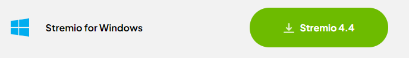
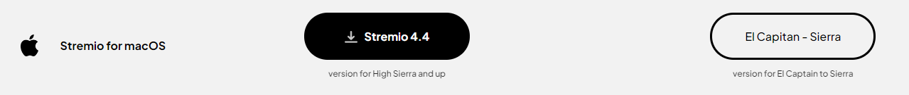
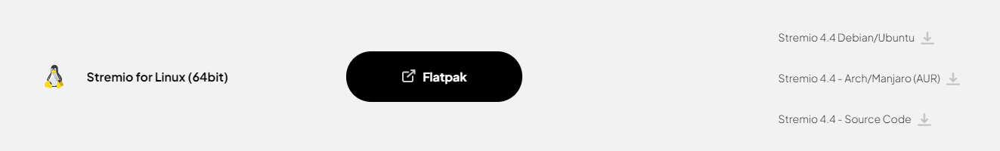
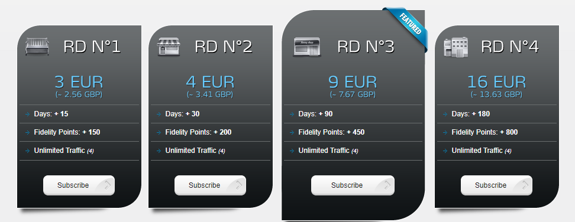

import Tabs from '@theme/Tabs';
import TabItem from '@theme/TabItem';
import Admonition from '@theme/Admonition';

# Guide
I will now begin the guide to setting up Stremio and its addons. I recommend that the **initial setup is completed on your laptop or desktop**. Once it has been setup, you can log in to Stremio with the same account on any device and your configuration will be synced to the device so there is no need to set it up again.

## Creating a Stremio Account

First, we need to create a Stremio account. This allows you to keep your progress on different content synced across devices and also allows you to sync your configuration so that it does not need to be repeated.

Head over to [Stremio](https://stremio.com/) and either [sign up for an account](https://www.stremio.com/register) with an email or [login](https://stremio.com/login) through Facebook.

## Downloading Stremio
Head to the [downloads page](https://stremio.com/downloads) and download the required package.

If you can't find the download link for your device, I will go through the instructions for each device here.

:::warning
iOS users, I recommend that you follow the instructions in the iOS tab as the Stremio app available in the App Store is very limited and will not provide the full experience.
:::

<Tabs>
<TabItem value="pc" label="PC" default>

    For windows, download the following: 

    

    For Mac OS, download one of the following depending on your version of Mac OS:

    

    For Linux, download one of the following:
    
    

    There are packages available for popular distributions of Linux such as Debian and Arch Linux. However, there is also a flatpak link as well as a link to the source code. 

    The flatpak can be used to install Stremio on the Steam Deck too. 

</TabItem>
<TabItem value="android" label="Android">
    
    Stremio can be installed from the [Play Store](https://play.google.com/store/apps/details?id=com.stremio.one).

    However, you can also download one of the following:

    

    You will most likely need to download the ARM64 APK.

    - ARM (armeabi-v7a) - 32 bit 
    - ARM64 (arm64-v8a) - 64 bit 
    - x86 - 32 bit Intel 
    - x86_64 - 64 bit Intel

</TabItem>
<TabItem value="ios" label="iOS">

    As the app in the App Store is a limited version, you can follow this [blog post](https://blog.stremio.com/using-stremio-web-on-iphone-ipad/) to set up a PWA (Progressive Web App). 
    This will give you access to most of Stremio's features. 

    Although following the blog post will give you access to most of Stremio's features, it will not allow you to stream torrents. 
    This means you can only use HTTP addons which are mostly unreliable. However, there are two ways to gain access to the massive library of torrents through Stremio. 

    The first way is to pay for a debrid service. This will allow you to stream torrents through HTTP. This is the easiest and most recommended way to use Stremio on iOS.
    To use this method, simply follow the guide as normal but you must also set up a debrid service.

    The second way is to have another device running the [Stremio service](https://www.stremio.com/download-service). You then connect to the Stremio service on your iOS device. This way will allow you to stream torrents directly on Stremio.
    Follow this [blog post](https://blog.stremio.com/using-stremio-service/) to set up the Stremio service. 

   

</TabItem>
<TabItem value="amazon" label="Fire Devices">

    Stremio is not available on the amazon app store. To install Stremio, you will need to sideload the app. 
    
    I will now go through the steps to sideload the app. (Source: https://www.firesticktricks.com/sideload-apps-on-firestick.html)

    1. In the home screen, click on the search icon to access the find menu. 

    2. Search for Downloader 

    3. Click on the `Downloader` app and then click get/download.

        

    4. Navigate to the settings menu from the home screen 

        

    5. Scroll down to `My Fire TV` and click it 

    6. If you see the `Developer Options` setting under `About`, skip to step 10.

    7. Click `About`

    8. Click `Fire TV Stick Lite/4K/4K MAX` 7 times quickly. 

    9. You should then see a message saying `No need, you are already a developer` 

    10. Go back to the My Fire TV menu and click Developer Options

    11. You will see either `Install apps from unknown sources`, in which case you select that, and turn it ON. 

        Otherwise, you will see `Install unknown apps`. Select this, navigate to Downloader, and turn it ON.

    12. Go back to the home screen. Scroll to the end and click on the apps menu. Click on `My Apps`

        

    13. Select the Downloader app. 

    14. Click `Allow` if it asks for permission to access storage 

    15. Navigate to the Downloader settings and enable JavaScript

    16. Click `Browser` on the sidebar. 

    17. Enter the following URL in the searchbar `https://stremio.com/downloads` and click `Go`

    18. On the stremio website, scroll down to the android TV section and click the following link:
    
        

    19. The download should automatically start. When the Android installation prompt shows, click `Install` 

    20. When the install is finished, click Done. 

    21. When you click Done, a pop-up will appear on the Downloader app. You can click `Delete` to remove the APK file. This won't delete the app. 

    22. Stremio should now be installed to your Fire Stick. Launch Stremio from the same place you launched the downloader app from. 

    <Admonition type="info">
    You can also move Stremio to the top so that you can launch it directly from the home screen
    </Admonition>

</TabItem>
<TabItem value="android-tv" label="Android TV">
    
        Stremio can be installed from the [Play Store](https://play.google.com/store/apps/details?id=com.stremio.one).
    
        However, you can also download one of the following:
    
        
    
        You will most likely need to download the ARM APK.

        - ARM (armeabi-v7a) - 32 bit 
        - ARM64 (arm64-v8a) - 64 bit 
        - x86 - 32 bit Intel 
        - x86_64 - 64 bit Intel

</TabItem>
<TabItem value="samsung" label="Samsung TVs">
    
    Search for Stremio in the App Store of 2019+ Samsung TV models

</TabItem>
<TabItem value="lg" label="LG TVs">    

    Search for Stremio in the App Store of 2020+ LG TV models. 
    <Admonition type="note">
    Stremio may not appear in the search results. However, if you go to the enterntainment section of the app store. You should see Stremio
    </Admonition>

</TabItem>
</Tabs>
Then login to Stremio using the account you created earlier.

## Debrid Service

As explained before, a debrid service is not required. However, it removes the need for a VPN and removes the reliance on seeders for torrents by streaming from their servers at unrestricted speeds through HTTP which makes playing 4K content easy. For more details, please see [Debrid Services](technical-details#debrid-services) and the [FAQ](faq). 

Furthermore, a debrid service can be used to generate direct download links for any torrents such as games, software, music etc. without the need for a VPN as the torrenting is done by the debrid service.

### Which debrid service do I use?

There are many debrid services available to use. I will provide a tutorial for setting up Real Debrid, AllDebrid, Premiumize and Debrid-Link.

Here is a list of some other debrid services:
- [Offcloud](https://offcloud.com/)
- [Put.io](https://put.io/)

The main factors to consider are cost, optimality, and userbase. The two options that provide the greatest cost-value benefit are Real Debrid, AllDebrid and Debrid-Link. They are priced at the same point and the larger userbase ensures more torrents are regularly cached.
The average monthly cost for Real Debrid, AllDebrid and Debrid-Link comes down to around £2.30 if you get the 6-month subscription.

What I mean by optimality is how close you are to the servers of the Debrid service. The closer you are, the higher download speeds you will get from a Debrid Service. 

You can find the speed tests for some debrid services [here](faq#where-can-i-find-the-speed-tests-for-debrid-services). You can find the other speed tests on the debrid service's website.

The amount and variety of torrents that are cached on the Debrid service's servers are also important. The larger the userbase, the more torrents are cached. Real Debrid and AllDebrid have the largest userbases. 
However, even with the relatively smaller userbase of Debrid-Link and Premiumize, most popular torrents will still be cached. If you are only going to be watching popular movies and TV shows, then Debrid-Link or Premiumize is a good choice, if it is the fastest for you. 

Also, although many debrid services exist, it is up to addon creators to add support for debrid services. Real Debrid, AllDebrid and Premiumize are the most supported debrid services.

One other factor to consider is whether streaming from multiple IP addresses is important to you. 
Most of these Debrid services will only allow you to use their service from one IP address at a time. 
This means you can use it from an unlimited number of devices from any one IP address at a given time. 
You cannot, for example, use it on your mobile data while another device in your home uses your home network to use the debrid service. 

**If you do use 2 IP addresses at a given time, you risk having your account banned.**

If streaming from multiple IP addresses is important to you, then consider getting Premiumize as it allows multiple IP addresses. It does, however, set a limit on the storage of files you can have in your cloud storage.

Furthermore, most debrid services do not seed and will be labelled a leecher. If this is an issue for you, consider using Debrid-Link. 
Debrid-Link provides a way for you to seed torrents. 

:::info
All-Debrid does provide a free 7 day trial. If you are not sure that this is the right choice for you, I suggest that you use this 7 day trial to test it out. You can also buy the service for 15 days which will cost a small amount but can be used to test it out.
:::

I will now cover the instructions of setting up a Debrid Service. I will only cover setting up Real Debrid and AllDebrid.

<Tabs>
<TabItem value="real-debrid" label="Real Debrid"> 
    
    
    1. Go to https://real-debrid.com/ (Consider using [this affiliate link](http://real-debrid.com/?id=9483829) instead to support me)
    2. Click Sign Up to create an account
    3. Go to the Premium Offers page
    4. Choose a package and subscribe. I would recommend using Amazon Pay. Using your bank card is also secure but Amazon Pay is convenient if you already have a payment method setup there. 
</TabItem>
<TabItem value="all-debrid" label="AllDebrid">
    
    
    1. Go to https://alldebrid.com/ (Consider using [this affiliate link](https://alldebrid.com/?uid=3n8qa&lang=en) to support me)
    2. Register for an account
    3. Go to the Pricing page
    4. Choose a package and subscribe.
</TabItem>
<TabItem value="premiumize" label="Premiumize">
    

    1. Go to https://www.premiumize.me/
    2. Click Sign Up in the top right corner to create an account
    3. Click `Buy Premium` at the top of the page 
    4. Choose a package and subscribe.
</TabItem>
<TabItem value="debrid-link" label="Debrid-Link">
    

    1. Go to https://debrid-link.com/ (Consider using [this affiliate link](https://debrid-link.com/id/EY0JO) to support me) 
    2. Click Register in the top right corner or `Try it Free` on the home page. 
    3. Fill in the required details and click `Register`
    4. Click `Premium` in the top right corner 
    5. Choose a package and purchase it.
</TabItem>
</Tabs>
## Setting up Addons

As I mentioned before, the intial setup should be done on a laptop/desktop or an android device. Once you have set up the addons, you can log in to Stremio on any device and your configuration will be synced to that device.

Before we install the addons, we need to go through some of the pre-installed addons.

In this guide, I will be making use of the following feature to provide details on different addons. You need to click the addon name to expand the details.

[Addon Name]

  
[Addon Description and tutorial] 

:::info
If you are attempting to configure addons on Stremio Web or on an iPhone (which is just Stremio Web), read the following note.

I would recommend using another device with the app installed (not on iPhone) but you can use the following method:

Once an addon has been configured, attempt to find the URL. 
This may be given already or you might need to copy the link from the `Install` button. 
Some addons copy the link to your clipboard when you click install.

Now that you have the link, open Stremio, go to the addons page and either click the `+ Add addon` button (if the button is there) or the search bar and paste the link in.

If this still doesn't work, you should complete the initial setup on another device. You can borrow an android phone / laptop or go to the library. 
:::

### Removing pre-installed addons

The first picture above shows that when you click on a movie, Stremio will display links to third party streaming services that provide the selected content. The addon that does this is called WatchHub. 

The second picture shows catalogues from two different addons - YouTube and Public Domain Movies. The YouTube addon will show popular YouTube channels and allow you to view their latest videos. The Public Domain Movies addon will show movies that are now in the [Public Domain](https://en.wikipedia.org/wiki/Public_domain). Most of these movies are quite old and released in the 1900s. 

These addons are not required so it is recommended that they be removed. If, however, you prefer to keep them, then you may do so.

To remove these addons, go to the addons page (the puzzle icon on the navigation menu on the left of the screen) and click Uninstall on the following addons.

### Stream Provider Addons
I will now go through some addons that provide content to Stremio. 

These addons are the backbone to our on-demand streaming experience. They provide the video content that allows us to watch anything we want.

You can have a look at this [community hosted addon list](https://stremio-addons.netlify.app/) to view all the available addons. 
This list will have more addons listed than the ones shown in the Stremio app.

#### Torrent Addons

I will first go through the torrent addons. These addons are better as they provide a larger library of content and of higher quality than those available through the HTTP addons. 

These addons can be configured to use a debrid service to stream the torrents through HTTP. This is the recommended way to use these addons to avoid the risks of torrenting, and to avoid the reliance on seeders while streaming. (For more information, see [Debrid Services](technical-details#debrid-services))

Torrentio is the most popular addon and should be all that you need for all your content. However, it is not harmful to have backups installed.

All of the addons I will go through can be self-hosted except Torrentio and the Orion stremio addon. 

However, KnightCrawler is a fork of Torrentio that can be self-hosted.

Some of these addons have public instances available hosted either by themselves or through [ElfHosted](https://elfhosted.com/). ElfHosted also provide a customisable personal instance without rate-limits that costs money.

    
Torrentio

    

        Torrentio is a torrent search addon that scrapes public trackers. (For a in depth explanation of how Torrentio works, see [this reddit comment](https://www.reddit.com/r/StremioAddons/comments/19fmjlp/comment/kjlnwru/))
        
        To begin, head over to [Torrentio's config page](https://torrentio.strem.fun/configure) to manage the addon.
        
        Torrentio has a lot of options to customise your experience. I will go through each option explaining what it does and list my preferences and why.
        
        
        
        - `Providers`: I have them all checked excluding foreign languages because I only speak English. If you speak another language, you can check the box for that language.
        - `Sorting`: By quality then size. If you are not using a debrid service, then do By quality then seeders . This is because without a debrid service you are reliant on the number of seeders. However, with a debrid service the number of seeders is irrelevant to you.
        - `Priority foreign language`: Torrentio defaults to pulling English audio content regardless of origin source, so only change this if you prefer another language to display first.
        - `Exclude qualities`: If checked, the quality types selected will be excluded and suppressed from your search results. I only exclude *screener, CAM* and *Unknown* sources, therefore the only boxes I have checked are *screener, CAM* and *Unknown*. If you have slower internet or your devices aren't capable of playing 4k content, you may want to exclude 4K sources.
        - `Max results per quality`: I leave this blank to obtain all results.
        - `Debrid provider`: Choose your Debrid provider if you are using one. If not, skip the rest of the options.
        - `API Key`: Click *here*. This link will take you to your debrid provider's website where you can obtain your API key. Copy that and paste it here. (Struggling to find the API key? [click here](faq#where-can-i-find-my-debrid-api-key))
        - `Debrid options`
            - `Don't show download to debrid`: These links will be displayed with a Debrid Download] in front of them. These are torrents that were found but not downloaded to the Debrid's servers. Clicking this link sends a request to your Debrid provider to start downloading that torrent. Clicking it poses no risk to you. I leave this unchecked.
            - `Don't show debrid catalog`: This will show a catalogue showing the videos you have watched before using your Debrid provider. I check this box as it is unnecessary clutter.
            - `Show P2P torrent links for uncached` :  If checked, this will show links to stream torrents directly. There is almost no point to leaving this checked as it poses a risk to you if not in a third world country that doesn't care about piracy. I have this unchecked.
        
        Now we are done configuring Torrentio. The next step is to click `Install`. Doing so should automatically open Stremio prompting you to install once again.
    

    
KnightCrawler

    

        [KnightCrawler](https://github.com/knightcrawler-stremio/knightcrawler) is a fork of Torrentio. 

        KnightCrawler can be [selfhosted](https://github.com/knightcrawler-stremio/knightcrawler?tab=readme-ov-file#using) or [ElfHosted](https://elfhosted.com/apps/torrentio/)

        However, a free, public instance is available on ElfHosted. We can use this instead of selfhosting it. 
        
        To begin, head over to the [configuration page](https://knightcrawler.elfhosted.com/configure)
        
        
        
        - `Sorting`: By quality then size. If you are not using a debrid service, then do By quality then seeders . This is because without a debrid service you are reliant on the number of seeders. However, with a debrid service the number of seeders is irrelevant to you.
        - `Priority foreign language`: Torrentio defaults to pulling English audio content regardless of origin source, so only change this if you prefer another language to display first.
        - `Exclude qualities`: If checked, the quality types selected will be excluded and suppressed from your search results. I only exclude *screener, CAM* and *Unknown* sources, therefore the only boxes I have checked are *screener, CAM* and *Unknown*. If you have slower internet or your devices aren't capable of playing 4k content, you may want to exclude 4K sources.
        - `Max results per quality`: I leave this blank to obtain all results.
        - `Debrid provider`: Choose your Debrid provider if you are using one. If not, skip the rest of the options
        - `API Key`: Click *here*. This link will take you to your debrid provider where you can obtain your API key. Copy that and paste it here.(Struggling to find the API key? [click here](faq#where-can-i-find-my-debrid-api-key))
        - `Debrid options`
            - `Don't show download to debrid`: These links will be displayed with a [Debrid Download] in front of them. These are torrents that were found but not downloaded to the Debrid's servers. Clicking this link sends a request to your Debrid provider to start downloading that torrent. Clicking it poses no risk to you. I leave this unchecked.
            - `Don't show debrid catalog`: This will show a catalogue showing the videos you have watched before using your Debrid provider. I check this box as it is unnecessary clutter.
            - `Show P2P torrent links for uncached` :  If checked, this will show links to stream torrents directly. There is almost no point to leaving this checked as it poses a risk to you if not in a third world country that doesn't care about piracy. I have this unchecked.
        
        Now we are done configuring KnightCrawler. The next step is to click `INSTALL`. Doing so should automatically open Stremio prompting you to install once again. Click Install again and the addon should be installed.
    

    
Annatar

    

        [Annatar](https://github.com/g0ldyy/annatar) is a self hostable and fast torrent/debrid search addon. (It requires a debrid service)

        It can be [selfhosted](https://github.com/g0ldyy/annatar?tab=readme-ov-file#running-locally) or [ElfHosted](https://elfhosted.com/app/annatar/).

        You can find a full description of Annatar on their [GitHub page](https://github.com/g0ldyy/annatar)

        I will go through the setup using the free, public ElfHosted instance. If you don't want to selfhost but want more customisation, you can pay for your own instance on ElfHosted.

        To get started, head over to the [configuration page](https://annatar.elfhosted.com/configure). 

        You will see the following configuration page:

        

        I will now go through each option: 

        - `Debrid Provider` - Choose your debrid provider, Real Debrid, AllDebrid, Premiumize and Debrid-Link are supported. 

        - `Debrid API Key` - Obtain your API key from your debrid provider and paste it here. (Struggling to find your API key? [Click here](faq#where-can-i-find-my-debrid-api-key))

        - `Max Results` - Here you can choose from 3, 5 or 10. This is the maximum number of results that will be displayed. I choose 10 as I want to see the maximum number of results.

        - `Resolution` - You can select which resolutions you want to see. I leave all resolutions selected, however, if you have a slow internet connection or your device can't handle 4K content, you may want to deselect 4K.

        - `Video Quality` - You can select the video quality you want to see. I leave all selected.

        After you have configured Annatar, click `Install`. This will open Stremio and prompt you to install the addon. Click Install again and the addon will be installed.
    

 
    
MediaFusion

    

        [MediaFusion](https://github.com/mhdzumair/MediaFusion) is a universal stremio addon that provides a variety of content (including Live TV and Sports)

        Check the [features section](https://github.com/mhdzumair/MediaFusion?tab=readme-ov-file#-features) of their GitHub page to see all that the addon has to offer.

        This addon can be [selfhosted](https://github.com/mhdzumair/MediaFusion?tab=readme-ov-file#-local-add-on-deployment) or [ElfHosted](https://elfhosted.com/app/mediafusion/). 

        I will go through the setup using the free, public ElfHosted instance. If you don't want to selfhost but want more customisation, you can pay for your own instance on ElfHosted.

        To get started, head over to the [configuration page](https://mediafusion.elfhosted.com/configure).

        MediaFusion has a lot of options to customise your experience. I will go through each option explaining what it does and list my preferences and why. 

        ----

        - `Streaming Provider` - Here you can choose whether to use direct torrent or a debrid service or another provider. Select what you are using and then fill in the details below.
                                 Mediafusion supports authorising as a device, this is simpler but you can still use the API key method if you prefer. (Struggling to find the API key? [Click here](faq#where-can-i-find-my-debrid-api-key))

        - `Catalog Configuration` - Here you can choose which content is available to you through MediaFusion. Simply select the content you want to see. I will provide some notes on specific options below.
            - `Prowlarr Streams` - This will provide you with streams from Prowlarr. You should enable this to get more streams. 
            - `Torrentio Streams` - If you already have Torrentio installed, then there is no point in enabling this as it will just provide you with the same streams. 
            - `Contribution Streams` - Enabling this provide a stream on movies and shows that allow you to upload torrent files or magnet links to MediaFusion for the community. 
                                       You can read more about this [here](https://www.reddit.com/r/StremioAddons/comments/1cwaqh8/comment/l4w1bw1/)
            - `Provider Watchlist Catalog` - This will provide a catalog displaying all the files you have watched using the provider. I leave this unchecked as it is unnecessary clutter.
            - `Show Catalogs in Stremio` - This will show the catalogues in Stremio. I leave this checked as I want to see the catalogues for the content I have enabled.
        
        - `Streaming Preferences` 
            - `Select Streaming Resolutions` - Here you can choose which resolutions you want to see. I leave all resolutions selected, however, if you have a slow internet connection or your device can't handle 4K content, you may want to deselect 4K.
            - `Set File Size Filter` - Here you can use a max file size. I leave this at the end for an unlimited file size as I want to see all the streams available.
            - `Select & Arrange Sorting Priority` - Here you can choose the order in which the streams are displayed. I choose `Cached`, `Quality`, `Size` - in that order. If you are not using a debrid service, then do `Resolution` and `Seeders`. This is because without a debrid service you are reliant on the number of seeders. However, with a debrid service the number of seeders is irrelevant to you.
            - `Max Streams per Resolution` - Here you can choose the maximum number of streams per resolution. I set this to a large number like 50 as I want to see a high number of the streams available.
            - `Torrent Stream Display option` - Here you can choose how the torrent streams are displayed. I choose `Show parsed data`. Although there is a small chance that the parsed data is incorrect, it is usually correct and it is easier to read than the other options.
        
        Now that MediaFusion has been configured, click `Install`. This will open Stremio and prompt you to install the addon. Click Install again and the addon will be installed.
        
        You can also click `Share Installation URL` and copy the URL into either the Stremio addon search bar or the add addon menu on Stremio Web.

    

 
    
Comet

    

        [Comet](https://github.com/g0ldyy/comet) is a self hostable torrent/debrid search addon. (It requires a debrid service)
        One of its distinguishing features is that it supports using Proxy Debrid streams. This allows the use of Debrid streams on multiple IPs at the same time on the same account.
        
        However, you will have to use comet exclusively, no other addon that uses the same debrid should be being used at the same time as it will have a different IP address to the proxy. 
        
        You can read more about its features on the [Comet GitHub page](https://github.com/g0ldyy/comet?tab=readme-ov-file#features)

        Comet can be [selfhosted](https://github.com/g0ldyy/comet?tab=readme-ov-file#self-hosted) or [ElfHosted](https://elfhosted.com/app/comet/).
        
        For this guide, I will go through the setup using the free, public ElfHosted instance. If you don't want to selfhost but want more customisation, you can pay for your own instance on ElfHosted.

        To get started, head over to the [configuration page](https://comet.elfhosted.com/configure)

        - `Indexers` - Choose which indexers you want to use. I leave all of them checked to obtain the most results 
        - `Language` - Choose which language you want your results to have. I leave the following selected: multi_subs, multi_audio, dual_audio, english. You can more if you are going to watch content in other languages (e.g. japanese for anime)
        - `Max Results` - The maximum number of results to display. I set this to 150 to see the most results.
        - `Filter Titles` - If checked, titles will be checked to see if the titles don't match. I leave this unchecked in the case that there is more than 1 title for a movie. 
        - `Debrid Service` - Choose your debrid service. 
        - `Debrid API Key` - Obtain your API key from your debrid provider and paste it here. (Struggling to find your API key? [Click here](faq#where-can-i-find-my-debrid-api-key))

        Then click Install and a prompt will show on Stremio to install the addon. Click Install again and the addon will be installed. 

        If you don't have the stremio app installed and are using Stremio Web, you can copy the URL, go to the addons page, click the `+ Add addon` button and paste the URL in. 
    

 
    
Stremio-Jackett

    

        [Stremio-Jackett](https://github.com/aymene69/stremio-jackett) is a self hostable addon that resolves torrent links using Jackett (It does **not** require a debrid service)

        Stremio-Jackett can be [selfhosted](https://github.com/aymene69/stremio-jackett#installation) or [ElfHosted](https://elfhosted.com/app/stremio-jackett/).

        For this guide, I will go through the setup using the free, public ElfHosted instance. If you don't want to selfhost but want more customisation, you can pay for your own instance on ElfHosted.

        To get started, head over to the [configuration page](https://stremio-jackett.elfhosted.com/configure)

        - `Enable debrid service` - If you are using a debrid service, you can check this box. You will then see the `Debrid Information` section below. 
        - `Enable torrenting` - If you want to use torrents, check this box. If you are using a debrid service, there isn't a need to check this box. 

        If you are using a debrid service, you can fill in the `Debrid Information` section.
        - `Debrid Provider` - Choose your debrid provider. 
        - `Debrid API Key` - Obtain your API key from your debrid provider and paste it here. (Struggling to find your API key? [Click here](faq#where-can-i-find-my-debrid-api-key))
        - `Metadata Provider` - You can select which metadata provider you want to use. I change this to TMDB. You will need to obtain an API key for this. If you are struggling to obtain an API key, [click here](faq#how-to-obtain-a-tmdb-api-key)
        - `Sorting` - I prefer to sort by size descending. This gives me the highest sized files first. I do this because, generally, the higher the size, the higher the bitrate and the better the quality. Although, in some cases, a lower sized file can have better quality. 
        - `Quality Exclusion` - You can choose to exclude certain qualities. I check the boxes for `CAMs` as I don't want to watch CAMs.
        - `Languages` - You can choose which languages you want to see. I only speak English so I only check English. I also check MULTi.  
        - `Maximum size` - I set this to 500 to see all the results.
        - `Maximum results` - I set this to 100 to see all the results.

        
    

    
Jackettio

    

        [Jackettio](https://github.com/arvida42/jackettio) is a self hostable addon that resolves streams using Jackett and a debrid service. 

        You can find a full list of features on the [features section](https://github.com/arvida42/jackettio#features) of their GitHub page.

        Jackettio can be [selfhosted](https://github.com/arvida42/jackettio). 

        As there is no public instance available, I will not be going through the setup of Jackettio. However, you can follow the instructions on their GitHub page to set it up.
    

    
Orion

    

        [Orion](https://orionoid.com/) is an indexer for torrent, usenet and hoster links. 
        
        We will be using the [Orion Stremio Addon](https://github.com/gorlev/orion-stremio-addon) to access the links that Orion can provide.  

        If you are using Orion for free, you have a limit of 100 links per day. Their cheapest plan is $0.50 / month for 1000 daily links. You can check the pricing [here](https://orionoid.com/#packages).

        To get started, we first need to create an account on Orion:
            1. Head over to [Orion](https://orionoid.com/) 
            2. Click `GET FREE ACCOUNT` 
            3. Choose the registration type (email or username). I recommend username if you are testing as you can always add an email later. 
            4. Fill in the username and password fields and click register. 

        Now that we have logged in, we need to configure our Orion account with any debrid services we are using.
        1. Once you are logged in, head to your [account panel](https://panel.orionoid.com/)
        2. Click on the `Account` menu on the navigation bar on the left of the screen.
        3. Then click `Services` at the top. 
        4. Choose the debrid service you are using and click `Add Service`. 
        
            Depending on your provider, you either need to authorise Orion as a device by following the on-screen instructions after clicking `Authorise` or you need to paste your API key in the box provided. (Struggling to find your API key? [Click here](faq#where-can-i-find-my-debrid-api-key))

        Finally, we need to configure the Orion Stremio Addon, head over to the [Orion Stremio Addon Configuration page](https://5a0d1888fa64-orion.baby-beamup.club/configure)
        - `Orion API key` - You can find this on your [account panel](https://panel.orionoid.com/) in the main `Dash` page or `Account` -> `Profile` -> `API Key`. 
        - `Link limit per search` - This is the maximum number of links that will be displayed per search. 
            
           Depending on your plan, you may want to change this to lower values as each link that is displayed when you click on a movie/show counts towards your daily limit. I set mine to 10 (this means I can search for 10 movies/shows before I reach my daily limit on the free plan)

        - `Sorting` - The sorting options available here are much more varied compared to other addons. You can experiment with these to see which one you prefer. I still choose `Sort by file size`. 
        - `Video Quality` - I leave the default selection of options (4K (HD), 1080p (HD), 720p (HD), SD). The SCR means Screener and CAM means Camera. I exclude these as they are of lower quality.
        
        The next step is to click `Install`. This will open Stremio and prompt you to install the addon. Click Install again and the addon will be installed.

        You can also click the clipboard button to copy the installation URL and paste it into the Stremio addon search bar or the add addon menu on Stremio Web. 
    

#### HTTP Addons 

If you do not want to use a debrid service or a torrent addon, you can use HTTP addons. These addons will provide links to stream content from third party sources. 
HTTP addons generally have lower quality than torrent addons and are more likely to be taken down. 
However, if you have a working link from a good source, you are unlikely to have buffering compared to torrents which can buffer without a debrid service.

Here is a list of some HTTP addons:
- [JaMovies](https://eja-addon.vercel.app/) (Only 1 stream but provides 1080p links from VidSrc)
- [Shluflix](https://shluflix.elfhosted.com/configure)
- [Stremify](https://stremify.elfhosted.com/configure)

The basic setup for Stremio has now been completed. You can now search for a movie and you will be provided with high quality links to stream from.

However, your home page will be quite empty. The next section will go through how to populate your home page with popular movies and shows. 
You will also not have any subtitles, so I highly recommend that you continue to read this guide to the end to get the full experience.

It is also possible to populate your homepage with customised lists such as recommendations or a list that dynamically updates according to strict filters that you can customise. 
I will go through this in the [Using Trakt](using-trakt) section of this guide. I highly recommend that you read this section as it will provide you with a more personalised experience.

### Catalogue Addons

These are the addons that provide the different catalogues (the rows of movies/shows) on your Stremio homepage. 

There is one built-in addon called Cinemata which provides Popular and Featured Movies and Series. 
However, there may be some shows that provide more results with the TMDB addon, so I highly recommend that you install the TMDB addon.

#### General Catalogues

These addons provide general catalogues of movies and shows such as popular, trending, new, featured, award-winning etc.

TMDB Addon

    

    
    The TMDB addon that will fetch data from The Movie Database to display Popular and New Movies and Series. 
    It is recommended that you install this addon as it will provides alternate metadata that may result in more links for some series/shows. 
    
    
    
    1. Head to the [TMDB Addon Configuration page](https://94c8cb9f702d-tmdb-addon.baby-beamup.club/configure)
    2. Configure the catalogue settings to your liking. (The ratings on poster is not required)
    3. Select your language.
    4. Click Install. 
    5. Stremio should now open and a prompt asking you to install should appear, click Install again.
    
    
    
    The addon should now be installed.
    

IMDB Catalogs

    

    This addon will add a catalogue that fetches movies and shows from IMDB. This addon requires no configuration, so it can be installed from directly within the Stremio app. 
    
    1. Head to the addons page on the Stremio app
    2. Click on the Community Addons tab
    3. Search for `IMDB Catalog` and it should be the first result. 
    4. Click Install.
    

#### Streaming Service Catalogues
These addons will provide catalogues that pull movies and shows from popular streaming services (e.g. Netflix, Prime, Hulu, Disney+ etc.).

I recommend only installing one of them. If you install multiple, you may see the same content multiple times on your homepage. 
You can try both to see which you prefer but I recommend Streaming Catalogs.

Streaming Catalogs

    

    
    This addon is very similar to CyberFlix. It only provides 2 catalogues for each streaming service instead of 4.
    
    1. Head over to the [Streaming Catalogs Configuration page](https://7a82163c306e-stremio-netflix-catalog-addon.baby-beamup.club/)
    2. Click on the filter providers by country and select Any.
    3. Select the streaming services that you want to see in your home page for Stremio.
    4. Click Install addon and then when the Stremio app opens with a prompt asking to install, click Install again.
    

CyberFlix

    

    
    This Addon will fetch a list of movies from a range of different 3rd party streaming services as well as different catalogs for Kids, Anime, and Indian Movies. (It is recommended that you use the Kitsu Addon for Anime instead)
    
    To get started, head over to the [configuration page](https://cyberflix.elfhosted.com/)
    
    
    
    1. Click Setup
    2. Select up to 60 different catalogues to display on your homepage. Click the arrows to select/deselect specific types of catalogues for a streaming service.
    3. Click Next
    4. Rearrange the order of the catalogues to your liking and click Next again
    5. Then click Install on Stremio and a prompt should open in the Stremio app. Click Install on that prompt too.
    

#### Anime Catalogues

I will now go through some Anime catalogue addons. A reminder that these addons are only catalogue addons and do not provide any links themselves. 
However, Torrentio with the NyaaSi and AniDex providers enabled should provide you the necessary links. 

The Stremify addon also provides streams from Gogoanime if you are looking for http streams. 

Scroll up to the [Stream Provider Addons section](#stream-provider-addons) to see how to configure Torrentio and Stremify.

:::note
If you are planning to only watch on an android device, you may want to look into [Aniyomi](https://aniyomi.org) instead. 
It also has a torrentio extension that supports watching normal movies/show.
:::

Kitsu

    

    
    This addon is focused on providing catalogues for Anime. It provides Top Airing, Trending, Most Popular, Highest Rated, and Newest. It is recommended to use this addon for anime as you are more likely to get stream results with the metadata from the Kitsu addon.
    
    Similar to the IMDB Catalogs addon, this addon cannot be configured. I could not find the addon through the built in community addon search so I will go through the steps for installing an addon through the search bar.
    
    1. Copy this URL: [https://anime-kitsu.strem.fun/manifest.json](https://anime-kitsu.strem.fun/manifest.json)
    2. In the stremio application, paste the URL into any search bar. (main one or addon search bar). 
    3. A prompt should show giving you the option to install this addon. 
    
    You may also configure the [Anime Catalogs addon](https://1fe84bc728af-stremio-anime-catalogs.baby-beamup.club/configure) too.
    

Anime Catalogs

    

    
    This addon is similar to the Kitsu addon but provides a lot more catalogues from different sources (AniList, Kitsu, MyAnimeList, AniDB)
    
    1. Head over to the [Anime Catalogs Configuration page](https://1fe84bc728af-stremio-anime-catalogs.baby-beamup.club/configure)
    2. Select the catalogues that you want to see on your homepage.
    3. Click Install addon and then when the Stremio app opens with a prompt asking to install, click Install again.
    

animeo

Although this is not a catalogue addon, I will include it here as it is an addon that should be used in conjunction with the Kitsu addon for Anime.

This is an addon that uses the AniList API to track your anime progress. 
You can look at the [GitHub page for animeo](https://github.com/Jenrykster/animeo) that explains how to set it up and how it works. 

1. Head over to the [animeo Configuration page](https://7a625ac658ec-animeo.baby-beamup.club/configure)
2. Click `ANILIST LOGIN` at the top of the page and login with your AniList account. You will then be returned to the configration page
3. There are two options to configure, I will go through them now: 
    - `Kitsu entries only`: I recommend keeping this option checked. You will need the kitsu addon installed for this to work. 
                          This means that only when you are watching a title from the Kitsu addon will it be tracked. 
                          This is useful because it reduces the likelihood of incorrect titles being tracked. 
    - `Only update anime already on my list` - This option makes it so that only anime that you are already tracking on AniList will be updated. 
                                               I leave this unchecked as otherwise, new anime that I watch will not be tracked unless I manually add them on AniList.
3. Click Install. (If this doesn't work, follow the instructions underneath the install button that says to copy the link and paste it into the stremio search bar or the add addon menu on stremio web.)

### Subtitle Addons

Here are a list of working subtitle addons. This list may become outdated, please check the [community addons list with the subtitle filter](https://stremio-addons.netlify.app/?label=subtitles) if none of these work.

- [Official OpenSubtitles v3](https://opensubtitles-v3.strem.io/)
- [SubDL](https://subdl.addstrem.site/configure)
- [yifysubtitles by dexter21767](https://2ecbbd610840-yifysubtitles.baby-beamup.club/configure/)
- [Subscene - Reborn (UFO)](https://subscene.stremio.homes/)
- [OpenSubtitles (UFO)](https://opensubtitles.stremio.homes/)
- [MSubtitles](https://msubtitles.lowlevel1989.click/conf/api/v1/configure) (You need to add subtitles on the website)
- Legendasdivx - Addons for PT-PT and PT-BR. Must be registered. https://www.legendasdivx.pt/

## End of inital setup

Done! 
You have now setup Stremio and have one of the best on demand streaming experiences available. 

I highly recommend that you look at the next page ([Using Trakt](using-trakt)) to have a more personalised experience with recommendations, watchlists, customised catalogues and more. 

I would also recommend that you look at the [Extras](extras) page to see how you can customise or enhance your Stremio experience.

You can also check the [FAQ](faq) for any questions you may have or the [Troubleshooting](troubleshooting) page if you encounter any issues. 
