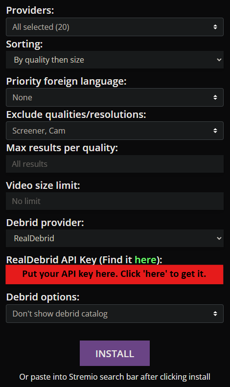

import Tabs from '@theme/Tabs';
import TabItem from '@theme/TabItem';
import Admonition from '@theme/Admonition';

# Guide
I will now begin the guide to setting up Stremio and its addons. I recommend that the initial setup is completed on your laptop or desktop. Once it has been setup, you can log in to Stremio with the same account on any device and your configuration will be synced to the device so there is no need to set it up again.

## Creating a Stremio Account

First, we need to create a Stremio account. This allows you to keep your progress on different content synced across devices and also allows you to sync your configuration so that it does not need to be repeated.

Head over to [Stremio](https://stremio.com/) and either [sign up for an account](https://www.stremio.com/register) with an email or [login](https://stremio.com/login) through Facebook.

## Downloading Stremio
Head to the [downloads page](https://stremio.com/downloads) and download the required package.
<Tabs>
<TabItem value="pc" label="PC" default>
    Stremio provides packages for Windows and Mac OS. 

    There are packages available for popular distributions of Linux such as Debian and Arch Linux. However, there is also a flatpak link as well as a link to the source code. 

    The flatpak can be used to install Stremio on the Steam Deck too. 

</TabItem>
    <TabItem value="android" label="Android">
    
    For android and android TV users, the app can be downloaded through the Play Store - [Play Store: Stremio](https://play.google.com/store/apps/details?id=com.stremio.one)
    However, you can also downloda the apk provided 

</TabItem>
    <TabItem value="ios" label="iOS">

    There is a basic version of Stremio available on the App Store.

    For a better experience, you can follow this [blog post](https://blog.stremio.com/using-stremio-web-on-iphone-ipad/). It shows you how to set up a PWA (Progressive Web App). This will give you access to all of Stremio's features.

    Because of some restrictions on iOS, you will need a debrid service. This is needed because iOS does not support torrent streaming.

    If you pay for a debrid service, you should not have any problems. But, you will need to follow the instructions in the blog post above to get the full Stremio app on your iOS device.
</TabItem>
    <TabItem value="samsung" label="Samsung TVs">
    
    Search for Stremio in the App Store of 2019+ Samsung TV models

</TabItem>
    <TabItem value="lg" label="LG TVs">    

    Search for Stremio in the App Store of 2020+ LG TV models. 
    <Admonition type="note">
    Stremio may not appear in the search results. However, if you go to the enterntainment section of the app store. You should see Stremio
    </Admonition>

</TabItem>
<TabItem value="amazon" label="Fire Devices">

    Stremio is not available on the amazon app store. To install Stremio, you will need to enable sideloading in developer settings.

    Follow [this guide](https://www.firesticktricks.com/sideload-apps-on-firestick.html) to enable sideloading on your fire stick. 

    Once sideloading is enabled, download the ARM APK that is designed to run on android TVs. This version of the app is built for a TV experience and for the ARM architecture.

</TabItem>
</Tabs>
Then login to Stremio using the account you created earlier.

## Debrid Service (Optional)

As explained before, a debrid service is not required. However, it removes the need for a VPN and removes the reliance on seeders for torrents by streaming from their servers at unrestricted speeds through HTTP. For more details, please see [Debrid Services](technical-details#debrid-services) and the [FAQ](faq).

There are many debrid services available to use.

My recommendation is either Real Debrid or AllDebrid due to its excellent cost-value benefit (I personally use Real Debrid and so does most of the community). If you get the 6-month subscription, the monthly cost comes down to around £2.30. 

All-Debrid does provide a free 7 day trial. If you are not sure that this is the right choice for you, I suggest that you use this 7 day trial to test it out. You can also buy the service for 15 days which will cost a small amount but can be used to test it out.

Deciding which debrid provider to use comes down to personal preference. There should be almost no difference between the two but the torrents available on a debrid service is dependent on the users of the service and what torrents the users are caching.

Here is a list of some other debrid services:

- [Premiumize](https://www.premiumize.me/)
- [Debrid-Link](https://debrid-link.com/)
- [Offcloud](https://offcloud.com/)
- [Put.io](https://put.io/)

:::warning
Keep in mind that you cannot use the service from several locations at once. You are allowed to connect from unlimited devices as long as they do it through the same public IP address. If you do, you risk having your account banned. 

If streaming from multiple IPs is important to you, consider using Premiumize as that allows unlimited IPs.
:::
:::note
 Before committing to a Debrid service, please make sure you have a capable internet speed  through [https://fast.com](https://fast.com) and also check that you are in a suitable location close to the Debrid providers servers. Check this through the speed tests provided on their website. ([Real Debrid’s Speed test](https://real-debrid.com/speedtest) and [AllDebrid’s Speed test](https://alldebrid.com/speedtest))
:::

I will now cover the instructions of setting up a Debrid Service. I will only cover setting up Real Debrid and AllDebrid.

<Tabs>
<TabItem value="real-debrid" label="Real Debrid"> 
    
    
    1. Go to [https://real-debrid.com/](https://real-debrid.com/) (Consider using [this affiliate link](http://real-debrid.com/?id=9483829) instead to support me)
    2. Click Sign Up to create an account
    3. Go to the Premium Offers page
    4. Choose a package and subscribe. I would recommend using Amazon Pay. Using your bank card is also secure but Amazon Pay is convenient if you already have a payment method setup there. 
</TabItem>
<TabItem value="all-debrid" label="AllDebrid">
    
    
    1. Go to [https://alldebrid.com/](https://alldebrid.com/register/) (Consider using [this affiliate link](https://alldebrid.com/?uid=3n8qa&lang=en) to support me)
    2. Register for an account
    3. Go to the Pricing page
    4. Choose a package and subscribe.
</TabItem>
</Tabs>

## Setting up Addons

Addons can not be configured on some systems such as the Samsung TV app. You will have to configure the addons on your phone or desktop.

There are a plethora of addons available for Stremio. I will go through the popular addons and configuring them. 

As addons are community provided, the addons provided here may become outdated or superseded by new ones. Use this [community hosted addon list](https://stremio-addons.netlify.app/) to view all the available addons. This list will have more addons listed than the ones shown in the Stremio app.

Before this, we need to go through some of the pre-installed addons.

### Removing pre-installed addons

The first picture above shows that when you click on a movie, Stremio will display links to third party streaming services that provide the selected content. The addon that does this is called WatchHub. 

The second picture shows catalogues from two different addons - YouTube and Public Domain Movies. The YouTube addon will show popular YouTube channels and allow you to view their latest videos. The Public Domain Movies addon will show movies that are now in the [Public Domain](https://en.wikipedia.org/wiki/Public_domain). Most of these movies are quite old and released in the 1900s. 

These addons are not required so it is recommended that they be removed. If, however, you prefer to keep them, then you may do so.

To remove these addons, go to the addons page (the puzzle icon on the navigation menu on the left of the screen) and click Uninstall on the following addons.

### Stream Provider Addons

These addons are the backbone to our on-demand streaming experience. They provide the video content that allows us to watch anything we want.

Torrentio is the most popular addon and should be all that you need for all your content. However, it is not harmful to have backups installed.

Many of the alternative addons will be hosted on [ElfHosted](https://elfhosted.com/). Although you have to pay for private instances of the addon, they provide free instances with a reasonable rate limit. Through casual viewing, these rate limits are unlikely to be hit and they are only in place to protect ElfHosted from people using automation.

I will only provide detailed instructions for Torrentio and KnightCrawler. Other addons will follow a similar structure to setting up. Ensure that any option relating to direct torrenting is disabled if you do not want to torrent and customise the addon as you wish.

    
Torrentio

    

    
    (For a in depth explanation of how Torrentio works, see [this reddit comment](https://www.reddit.com/r/StremioAddons/comments/19fmjlp/comment/kjlnwru/).)
    
    To begin, head over to [Torrentio's config page](https://torrentio.strem.fun/configure) to manage the addon.
    
    Torrentio has a lot of options and it can be overwhelming at first. Below I've listed my recommendations and my personal configuration:
    
    
    
    - `Providers`: I have them all checked excluding foreign languages.
    - `Sorting`: By quality then size. If you are not using a debrid service, then do By quality then seeders . This is because without a debrid service you are reliant on the number of seeders. However, with a debrid service the number of seeders is irrelevant to you.
    - `Priority foreign language`: Torrentio defaults to pulling English audio content regardless of origin source, so only change this if you prefer another language to display first.
    - `Exclude qualities`: If checked, the quality types selected will be excluded and suppressed from your search results. I only exclude *screener, CAM* and *Unknown* sources, therefore the only boxes I have checked are *screener, CAM* and *Unknown*. If you have slower internet or your devices aren’t capable of playing 4k content, you may want to exclude 4K sources.
    - `Max results per quality`: I leave this blank to obtain all results.
    - `Debrid provider`: Choose your Debrid provider if you are using one. If not, skip the rest of the options.
    - `API Key`: Click *find it here* or create it here. This will link to RD or AD displaying your API key. Copy that and paste it into Torrentio.
    - `Debrid options`
        - `Don't show download to debrid`: These links will be displayed with a [RD Download] in front of them. These are torrents that were found but not downloaded to the Debrid’s servers. Clicking this link sends a request to your Debrid provider to start downloading that torrent. Clicking it poses no risk to you. I leave this unchecked.
        - `Don't show debrid catalog`: This will show a catalogue showing the videos you have watched before using your Debrid provider. I check this box as it is unnecessary clutter.
        - `Show P2P torrent links for uncached` :  If checked, this will show links to stream torrents directly. There is almost no point to leaving this checked as it poses a risk to you if not in a third world country that doesn’t care about piracy. I have this unchecked.
    
    Now we are done configuring Torrentio. The next step is to click `Install`. Doing so should automatically open Stremio prompting you to install once again.
    

    
 KnightCrawler (ElfHosted)

    

    KnightCrawler is a fork of Torrentio and the setup for it is almost the same.
    
    To begin, head over to [KnightCrawler’s config page](https://knightcrawler.elfhosted.com/configure)
    
    
    
    - `Sorting`: By quality then size. If you are not using a debrid service, then do By quality then seeders . This is because without a debrid service you are reliant on the number of seeders. However, with a debrid service the number of seeders is irrelevant to you.
    - `Priority foreign language`: Torrentio defaults to pulling English audio content regardless of origin source, so only change this if you prefer another language to display first.
    - `Exclude qualities`: If checked, the quality types selected will be excluded and suppressed from your search results. I only exclude *screener, CAM* and *Unknown* sources, therefore the only boxes I have checked are *screener, CAM* and *Unknown*. If you have slower internet or your devices aren’t capable of playing 4k content, you may want to exclude 4K sources.
    - `Max results per quality`: I leave this blank to obtain all results.
    - `Debrid provider`: Choose your Debrid provider if you are using one. If not, skip the rest of the options
    - `API Key`: Click *find it here* or create it here. This will link to RD or AD displaying your API key. Copy that and paste it into Torrentio.
    - `Debrid options`
        - `Don't show download to debrid`: These links will be displayed with a [RD Download] in front of them. These are torrents that were found but not downloaded to the Debrid’s servers. Clicking this link sends a request to your Debrid provider to start downloading that torrent. Clicking it poses no risk to you. I leave this unchecked.
        - `Don't show debrid catalog`: This will show a catalogue showing the videos you have watched before using your Debrid provider. I check this box as it is unnecessary clutter.
        - `Show P2P torrent links for uncached` :  If checked, this will show links to stream torrents directly. There is almost no point to leaving this checked as it poses a risk to you if not in a third world country that doesn’t care about piracy. I have this unchecked.
    
    Now we are done configuring KnightCrawler. The next step is to click `INSTALL`. Doing so should automatically open Stremio prompting you to install once again. Click Install again and the addon should be installed.
    

Here is a list of other addons that use torrent streams with debrid support. These may also have additional features and provide more content in some scenarios.:

- [Stremio-Jackett](https://stremio-jackett.elfhosted.com/configure)
- [Jackettio](https://jackettio.elfhosted.com/configure)
- [MediaFusion](https://mediafusion.elfhosted.com/configure) (supports live streams)
- [Annatar](https://annatar.elfhosted.com/configure) ([No longer being developed](https://gitlab.com/stremio-add-ons/annatar/-/issues/40) so may stop working.)
- [Orion](https://orionoid.com/) 

If you do not want to use a debrid service or a torrent addon, you can use HTTP addons. These addons will provide links to stream content from third party sources. The speeds will be slower than torrents and you may encounter buffering.
Here is a list of some HTTP addons:
- [JaMovies](https://eja-addon.vercel.app/) (Only 1 stream but provides 1080p links from VidSrc)
- [Shluflix](https://shluflix.elfhosted.com/configure)

For more addons, please see the [community hosted addon list with the http filter](https://stremio-addons.netlify.app/?label=http-streams)

The basic setup for Stremio has now been completed. If you search for a specific movie and click on it, you should see links to stream the selected movie with [RD] in its name. You could theoretically stop now. The next few addons I will go through are optional addons that mainly focus on giving you an experience more like streaming services by populating your Home page with popular/new/trending movies or other content of your liking.

### Catalogue Addons

These are the addons that provide categories for your Stremio homepage. It'll pull, for example, `Netflix movies popular`, `Netflix movies new`, `Netflix series popular`, `Netflix series new`, etc. to create a semi-endless scrolling experience that pulls all of the best and newest that film and TV have to offer, and everything else in between. 

Note that Stremio will display the catalogues from the addons in the order that they were installed. Therefore, install the catalogue addons in the order you want them to appear on your homepage. However, the order can be changed through an external addon manager. I will go through this in the Extras section.

There is one built-in addon called Cinemata which provides Popular and Featured Movies and Series. If you feel that Cinemata is enough then you do not need to install any others. However, it is recommended that you at least try them out and see what the addons do.

I will go through the most popular addons that are used currently. However, be sure to look through the Community addons on Stremio and on the community hosted website I linked earlier as there are always new addons being created. 

:::note
CyberFlix and Streaming Catalogs are very similar and will show very similar content. I recommend that you only install one of them
:::

:::note
For those looking to watch anime, I would recommend using [Aniyomi](../category/aniyomi) (An android only app) instead, it also supports using Torrentio and it supports tracking with AniList, MyAnimeList, Trakt, Kitsu and more. It also has an AniSkip feature which allows you to skip intros. As an app built for anime, I feel it is a much better choice. The lack of syncing on Stremio is also a factor to think about. the animeo addon does allow syncing, however it only supports AniList and it updates AniList when you start watching an episode. animeo may support more tracking services in the future. However, it is only an android app so if watching on TV or other devices is important to you, then Stremio may still be enough.
:::

TMDB Addon

    

    
    The TMDB addon that will fetch data from The Movie Database to display Popular and New Movies and Series. 
    
    
    
    1. Head to the [TMDB Addon Configuration page](https://94c8cb9f702d-tmdb-addon.baby-beamup.club/configure)
    2. Configure the catalogue settings to your liking. (The ratings on poster is not required)
    3. Select your language.
    4. Click Install. 
    5. Stremio should now open and a prompt asking you to install should appear, click Install again.
    
    
    
    The addon should now be installed.
    

IMDB Catalogs

    

    This addon will add a catalogue that fetches movies and shows from IMDB. This addon requires no configuration, so it can be installed from directly within the Stremio app. 
    
    1. Head to the addons page on the Stremio app
    2. Click on the Community Addons tab
    3. Search for `IMDB Catalog` and it should be the first result. 
    4. Click Install.
    

CyberFlix

    

    
    This Addon will fetch a list of movies from a range of different 3rd party streaming services as well as different catalogs for Kids, Anime, and Indian Movies. (It is recommended that you use the Kitsu Addon for Anime instead)
    
    To get started, head over to the [configuration page](https://cyberflix.elfhosted.com/)
    
    
    
    1. Click Setup
    2. Select up to 60 different catalogues to display on your homepage. Click the arrows to select/deselect specific types of catalogues for a streaming service.
    3. Click Next
    4. Rearrange the order of the catalogues to your liking and click Next again
    5. Then click Install on Stremio and a prompt should open in the Stremio app. Click Install on that prompt too.
    

Streaming Catalogs

    

    
    This addon is very similar to CyberFlix. It only provides 2 catalogues for each streaming service instead of 4.
    
    1. Head over to the [Streaming Catalogs Configuration page](https://7a82163c306e-stremio-netflix-catalog-addon.baby-beamup.club/)
    2. Click on the filter providers by country and select Any.
    3. Select the streaming services that you want to see in your home page for Stremio.
    4. Click Install addon and then when the Stremio app opens with a prompt asking to install, click Install again.
    

Kitsu

    

    
    This addon is focused on providing catalogues for Anime. It provides Top Airing, Trending, Most Popular, Highest Rated, and Newest. It is recommended to use this addon for anime as you are more likely to get stream results with the metadata from the Kitsu addon.
    
    Similar to the IMDB Catalogs addon, this addon cannot be configured. I could not find the addon through the built in community addon search so I will go through the steps for installing an addon through the search bar.
    
    1. Copy this URL: [https://anime-kitsu.strem.fun/manifest.json](https://anime-kitsu.strem.fun/manifest.json)
    2. In the stremio application, paste the URL into any search bar. (main one or addon search bar). 
    3. A prompt should show giving you the option to install this addon. 
    
    You may also configure the [Anime Catalogs addon](https://1fe84bc728af-stremio-anime-catalogs.baby-beamup.club/configure) too.
    

### Advanced Customised Catalogues

The previous addons provide a good experience for most users. However, they only provide content from a few streaming services. If you want to have a more customised experience with personalised lists, then you can use the Trakt Lists addon.

#### What is Trakt?

Trakt is a media tracking service that helps users sync their TV shows and movies across numerous platforms and devices. It also allows users to create custom lists of movies and TV shows.
Stremio has built-in Trakt scrobbling support. This means that you can sync what you watch on Stremio to your Trakt account. This is useful if you want to keep track of what you have watched.

Enabling Trakt scrobbling

    

    Trakt scrobbling is a feature that allows you to keep track of what you have watched. This is useful if you want to keep track of what you have watched and also to get recommendations based on what you have watched.
    It is built into Stremio and can be enabled through the settings page.

    1. First, we need to create a Trakt account. Head over to [Trakt](https://trakt.tv/) and sign up for an account.
    2. Now, head over to your [account settings](https://www.stremio.com/acc-settings) on Stremio. If the link doesn't work, head over to [Stremio](https://www.stremio.com/) and click on either `My Account` or `Login` in the top right.
    3. Click on the Integrations tab and click `Authenticate` next to Trakt Scrobbling to enable it.
        
    4. Login to your Trakt account and allow Stremio to access your account.
    

#### Setting up the Trakt Lists addon

Go to the configuration page for the Trakt addon from the addons section or from [here](https://2ecbbd610840-trakt.baby-beamup.club/configure/)

:::info
You may not be able to use the toggles on the addon configuration page on mobile, please try on a desktop or laptop.
:::

Most Trakt lists are not dynamic. This means that the content will not be updated if the owner of the list or collaborators do not maintain them. This is where [MDBList](https://mdblist.com/) and [couchmoney](https://couchmoney.tv/) come in.
It is better to have dynamic lists as they will always be updated with the latest movies and shows that are released.

Now that we have covered the basics, let's go and add a few lists. Head to the add lists section on the addon configuration page:

We now need to add the lists we want. There is no need to create our own lists. We can use lists created by other users.
For couchmoney, you will need a Trakt account and you need to have watched some content. This is because the addon will use your watched history to make suggestions

<Tabs>
<TabItem value="mdblist" label="MDBList" default>
    <Admonition type="info">
    If you are using public lists, a Trakt account is not required.
    </Admonition>
    MDBList offers a plethora of filters to match our search criteria. For example, we could create a list where action movies from 2010 to the present with over 60 rank on Rotten Tomatoes order by release date are shown. We can create up to 4 lists with a free account. A Trakt account is required if we want to create our own lists.

    I recommend you take a look at the MDBList lists from [Gary](https://mdblist.com/lists/garycrawfordgc/) and [Riz](https://mdblist.com/lists/rizreflects/).
    You may also browse the top lists and search them [here](https://mdblist.com/toplists/).

    Once you have found a list on MDBList, right click the trakt icon and click `Copy link address`. This will copy the URL of the list to your clipboard.
    

    If you are browsing on the Top Lists page, you can right click the Trakt button and click `Copy link address`. This will copy the URL of the list to your clipboard.
    

</TabItem>
    <TabItem value="couchmoney" label="Couchmoney">
        <Admonition type="info">
        Couchmoney requires a Trakt account and you need to have some history, preferably with ratings.
        </Admonition>
        [Couchmoney](https://couchmoney.tv/) creates custom personalised lists based on recently watched, trending, or a specific list. We can filter the content by date, genre, language, and popularity. We can create up to 10 lists. A Trakt account is required.

        The lists should show up on Trakt now. Copy the list URL into your clipboard. 

</TabItem>
    <TabItem value="trakt" label="Trakt">
    To find lists directly from Trakt, you can [search](https://trakt.tv/search/lists) for lists on the Trakt website. Filtering requires VIP.
    On the trakt page for the list, copy the URL from the address bar. It should look something like this: `https://trakt.tv/users/username/lists/list-name`    
</TabItem>
</Tabs>

---

Now that you have the URL of the list you want to add:
1. Go to the addon configurataion page 
2. Paste in the URL into the Paste List URL box. 
3. Click `Add List` 
    :::info
    You only need to click it once, scroll down to the bottom of the configuration page to see if the list was added.
    :::

    

    After you've added the lists, the lists should show up at the bottom like this:

    

4. Now click `Install Addon`

You should now see the lists on your home page. 

### Subtitle Addons

Here are a list of working subtitle addons. This list may become outdated, please check the community addons list for new subtitle addons if none of these work.

- [Official OpenSubtitles v3](https://opensubtitles-v3.strem.io/)
- [Official OpenSubtitles v2](https://subtitlesv2.strem.io/)
- [Official OpenSubtitles v0.24.0](https://opensubtitles.strem.io/stremio/v1)
- [SubDL](https://stremio-subdl.vercel.app/configure)
- [yifysubtitles by dexter21767](https://2ecbbd610840-yifysubtitles.baby-beamup.club/configure/)
- [Subscene - Reborn (UFO)](https://subscene.stremio.homes/)
- [OpenSubtitles (UFO)](https://opensubtitles.stremio.homes/)
- [MSubtitles](https://msubtitles.lowlevel1989.click/conf/api/v1/configure) (You need to add subtitles on the website)
- Legendasdivc - Addons for PT-PT and PT-BR. Must be registered. https://www.legendasdivx.pt/
