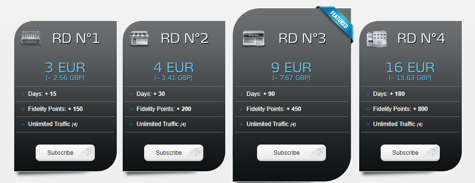

# Guide
I will now begin the guide to setting up Stremio and its addons. I recommend that the initial setup is completed on your laptop or desktop. Once it has been setup, you can log in to Stremio with the same account on any device and your configuration will be synced to the device so there is no need to set it up again.

## Creating a Stremio Account

First, we need to create a Stremio account. This allows you to keep your progress on different content synced across devices and also allows you to sync your configuration so that it does not need to be repeated.

Head over to [Stremio](https://stremio.com/login) and either [sign up for an account](https://www.stremio.com/signup) with an email or login through Facebook.

## Downloading Stremio

Head over to the [Stremio Downloads](https://www.stremio.com/downloads) page and download the required package for your device.

### PC

Stremio provides packages for Windows and Mac OS. 

There are packages available for popular distributions of Linux such as Debian and Arch Linux. However, there is also a flatpak link as well as a link to the source code. 

The flatpak can be used to install Stremio on the Steam Deck too.

### Android (Mobile & TV)

For android and android TV users, the app can be downloaded through the Play Store - [Play Store: Stremio](https://play.google.com/store/apps/details?id=com.stremio.one)

### iOS

A limited version of Stremio is available on the App Store. 

For a better experience, follow this [blog post](https://blog.stremio.com/using-stremio-web-on-iphone-ipad/) that explains how to setup a PWA which will allow you to get the full experience of Stremio. As mentioned at the end of the blog, a streaming server running on another device will be needed for torrent playback. However, as explained in Debrid Services, a debrid service does not fall under this category as it gives you a link to stream over HTTP.

### Samsung TVs

Search for Stremio in the App Store of 2019+ Samsung TV models

### LG TVs

Search for Stremio in the App Store of 2020+ LG TV models

### Amazon Fire TV / Fire TV Sticks.

Stremio is not available on the amazon app store. To install Stremio, you will need to enable sideloading in developer settings.

Follow [this guide](https://www.firesticktricks.com/sideload-apps-on-firestick.html) to enable sideloading on your fire stick. 

Once sideloading is enabled, download the ARM APK that is designed to run on android TVs. This version of the app is built for a TV experience and for the ARM architecture.

Then login to Stremio using the account you created earlier.

## Debrid Service (Optional)

As explained before, a debrid service is not required. However, it will allow you to stream 4K content at unrestricted speeds, which means no buffering. For more details, please see [Debrid Services](technical_details#debrid-services) and the [FAQ](faq)

There are many debrid services available to use.

My recommendation is either Real Debrid or AllDebrid due to its excellent cost-value benefit (I personally use Real Debrid and so does most of the community). If you get the 6-month subscription, the monthly cost comes down to around £2.30. 

All-Debrid does provide a free 7 day trial. If you are not sure that this is the right choice for you, I suggest that you use this 7 day trial to test it out. You can also buy the service for 15 days which will cost a small amount but can be used to test it out.

Deciding which debrid provider to use comes down to personal preference. There should be almost no difference between the two but the torrents available on a debrid service is dependent on the users of the service and what torrents the users are caching.

:::warning
Keep in mind that you cannot use the service from several locations at once. You are allowed to connect from unlimited devices as long as they do it through the same public IP address. If you do, you risk having your account banned.**
:::
Here is a list of some other debrid services:

- [Premiumize](https://www.premiumize.me/)
- [Debrid-Link](https://debrid-link.com/)
- [Offcloud](https://offcloud.com/)
- [Put.io](https://put.io/)

Note: Before committing to a Debrid service, please make sure you have a capable internet speed  through [https://fast.com](https://fast.com) and also check that you are in a suitable location close to the Debrid providers servers. Check this through the speed tests provided on their website. ([Real Debrid’s Speed test](https://real-debrid.com/speedtest) and [AllDebrid’s Speed test](https://alldebrid.com/speedtest))

I will now cover the instructions of setting up a Debrid Service. I will only cover setting up Real Debrid and AllDebrid.

- Real Debrid
    
    
    
    1. Go to [https://real-debrid.com/](https://real-debrid.com/) (Consider using [this affiliate link](http://real-debrid.com/?id=9483829) instead to support me)
    2. Click Sign Up to create an account
    3. Go to the Premium Offers page
    4. Choose a package and subscribe. I would recommend using Amazon Pay. Using your bank card is also secure but Amazon Pay is convenient if you already have a payment method setup there.
- AllDebrid
    
    
    
    1. Go to [https://alldebrid.com/](https://alldebrid.com/register/) (Consider using [this affiliate link](https://alldebrid.com/?uid=3n8qa&lang=en) to support me)
    2. Register for an account
    3. Go to the Pricing page
    4. Choose a package and subscribe.

## Setting up Addons

Addons can not be configured on some systems such as the Samsung TV app. You will have to configure the addons on your phone or desktop.

There are a plethora of addons available for Stremio. I will go through the popular addons and configuring them. 

As addons are community provided, the addons provided here may become outdated or superseded by new ones. Use this [community hosted addon list](https://stremio-addons.netlify.app/) to view all the available addons. This list will have more addons listed than the ones shown in the Stremio app.

Before this, we need to go through some of the pre-installed addons.

### Removing pre-installed addons

The first picture above shows that when you click on a movie, Stremio will display links to third party streaming services that provide the selected content. The addon that does this is called WatchHub. 

The second picture shows catalogues from two different addons - YouTube and Public Domain Movies. The YouTube addon will show popular YouTube channels and allow you to view their latest videos. The Public Domain Movies addon will show movies that are now in the [Public Domain](https://en.wikipedia.org/wiki/Public_domain). These movies are generally released in the 90s. 

These addons are not required so it is recommended that they be removed. If, however, you prefer to keep them, then you may do so.

The reason these addons being pre-installed is for Stremio to appear as a legitimate app that is not used for streaming pirated content.

To remove these addons, go to the addons page (the puzzle icon on the navigation menu on the left of the screen) and click Uninstall on the following addons.

### Stream Provider Addons

These addons are the backbone to our on-demand streaming experience. They provide the video content that allows us to watch anything we want.

Torrentio is the most popular addon and should be all that you need for all your content. However, it is not harmful to have backups installed.

Many of the alternative addons will be hosted on [ElfHosted](https://elfhosted.com/). Although you have to pay for private instances of the addon, they provide free instances with a reasonable rate limit. Through casual viewing, these rate limits are unlikely to be hit and they are only in place to protect ElfHosted from people using automation.

I will only provide detailed instructions for Torrentio and KnightCrawler. Other addons will follow a similar structure to setting up. Ensure that any option relating to direct torrenting is disabled if you do not want to torrent and customise the addon as you wish.

- Torrentio
    
    (For a in depth explanation of how Torrentio works, see [this reddit comment](https://www.reddit.com/r/StremioAddons/comments/19fmjlp/comment/kjlnwru/) from an unaffiliated user)
    
    To begin, head over to [Torrentio's config page](https://torrentio.strem.fun/configure) to manage the addon.
    
    Torrentio has a lot of options and it can be overwhelming at first. Below I've listed my recommendations and my personal configuration:
    
    
    
    - `Providers`: I have them all checked excluding foreign languages.
    - `Sorting`: By quality then size. If you are not using a debrid service, then do By quality then seeders . This is because without a debrid service you are reliant on the number of seeders. However, with a debrid service the number of seeders is irrelevant to you.
    - `Priority foreign language`: Torrentio defaults to pulling English audio content regardless of origin source, so only change this if you prefer another language to display first.
    - `Exclude qualities`: If checked, the quality types selected will be excluded and suppressed from your search results. I only exclude *screener, CAM* and *Unknown* sources, therefore the only boxes I have checked are *screener, CAM* and *Unknown*. If you have slower internet or your devices aren’t capable of playing 4k content, you may want to exclude 4K sources.
    - `Max results per quality`: I leave this blank to obtain all results.
    - `Debrid provider`: Choose your Debrid provider
    - `API Key`: Click *find it here* or create it here. This will link to RD or AD displaying your API key. Copy that and paste it into Torrentio.
    - `Debrid options`
        - `Don't show download to debrid`: These links will be displayed with a [RD Download] in front of them. These are torrents that were found but not downloaded to the Debrid’s servers. Clicking this link sends a request to your Debrid provider to start downloading that torrent. Clicking it poses no risk to you. I leave this unchecked.
        - `Don't show debrid catalog`: This will show a catalogue showing the videos you have watched before using your Debrid provider. I check this box as it is unnecessary clutter.
        - `Show P2P torrent links for uncached` :  If checked, this will show links to stream torrents directly. There is almost no point to leaving this checked as it poses a risk to you if not in a third world country that doesn’t care about piracy. I have this unchecked.
    
    Now we are done configuring Torrentio. The next step is to click `Install`. Doing so should automatically open Stremio prompting you to install once again.
    
    **Note**: It is possible to use Stremio + Torrentio without a debrid service completely for free. Torrentio without debrid, as its name implies, streams torrents directly. Torrentio with debrid streams cached torrents via HTTPS and **does not** need a VPN. The experience IMO is far superior with a debrid service.
    
- KnightCrawler (ElfHosted)
    
    KnightCrawler is a fork of Torrentio and the setup for it is almost the same.
    
    To begin, head over to [KnightCrawler’s config page](https://knightcrawler.elfhosted.com/configure)
    
    
    
    - `Sorting`: By quality then size. If you are not using a debrid service, then do By quality then seeders . This is because without a debrid service you are reliant on the number of seeders. However, with a debrid service the number of seeders is irrelevant to you.
    - `Priority foreign language`: Torrentio defaults to pulling English audio content regardless of origin source, so only change this if you prefer another language to display first.
    - `Exclude qualities`: If checked, the quality types selected will be excluded and suppressed from your search results. I only exclude *screener, CAM* and *Unknown* sources, therefore the only boxes I have checked are *screener, CAM* and *Unknown*. If you have slower internet or your devices aren’t capable of playing 4k content, you may want to exclude 4K sources.
    - `Max results per quality`: I leave this blank to obtain all results.
    - `Debrid provider`: Choose your Debrid provider
    - `API Key`: Click *find it here* or create it here. This will link to RD or AD displaying your API key. Copy that and paste it into Torrentio.
    - `Debrid options`
        - `Don't show download to debrid`: These links will be displayed with a [RD Download] in front of them. These are torrents that were found but not downloaded to the Debrid’s servers. Clicking this link sends a request to your Debrid provider to start downloading that torrent. Clicking it poses no risk to you. I leave this unchecked.
        - `Don't show debrid catalog`: This will show a catalogue showing the videos you have watched before using your Debrid provider. I check this box as it is unnecessary clutter.
        - `Show P2P torrent links for uncached` :  If checked, this will show links to stream torrents directly. There is almost no point to leaving this checked as it poses a risk to you if not in a third world country that doesn’t care about piracy. I have this unchecked.
    
    Now we are done configuring KnightCrawler. The next step is to click `INSTALL`. Doing so should automatically open Stremio prompting you to install once again. Click Install again and the addon should be installed.
    

Here is a list of other addons that use torrent streams with debrid support. These may also have additional features and provide more content in some scenarios.:

- [Annatar](https://annatar.elfhosted.com/configure)
- [Stremio-Jackett](https://stremio-jackett.elfhosted.com/configure)
- [MediaFusion](https://mediafusion.elfhosted.com/configure) (supports live streams)
- [Orion](https://orionoid.com/) (Paid, not worth it)

For other addons such as HTTP streams, please check the community hosted addon list that I provided above.

The basic setup for Stremio has now been completed. If you search for a specific movie and click on it, you should see links to stream the selected movie with [RD] in its name. You could theoretically stop now. The next few addons I will go through are optional addons that mainly focus on giving you an experience more like streaming services by populating your Home page with popular/new/trending movies or other content of your liking.

### Catalogue Addons

These are the addons that provide categories for your Stremio homepage. It'll pull, for example, `Netflix movies popular`, `Netflix movies new`, `Netflix series popular`, `Netflix series new`, etc. to create a semi-endless scrolling experience that pulls all of the best and newest that film and TV have to offer, and everything else in between. 

Note that Stremio will display the catalogues from the addons in the order that they were installed. Therefore, install the catalogue addons in the order you want them to appear on your homepage. However, the order can be changed through an external addon manager. I will go through this in the Extras section.

There is one built-in addon called Cinemata which provides Popular and Featured Movies and Series. If you feel that Cinemata is enough then you do not need to install any others. However, it is recommended that you at least try them out and see what the addons do.

I will go through the most popular addons that are used currently. However, be sure to look through the Community addons on Stremio and on the community hosted website I linked earlier as there are always new addons being created.

:::note
For those looking to watch anime, I would recommend using [Aniyomi](../aniyomi) instead, it also supports using Torrentio and it supports tracking with AniList, MyAnimeList, Trakt, Kitsu and more. It also has an AniSkip feature which allows you to skip intros. As an app built for anime, I feel it is a much better choice. The lack of syncing on Stremio is also a factor to think about. the animeo addon does allow syncing, however it only supports AniList and it updates AniList when you start watching an episode. animeo may support more tracking services in the future.
:::

- **TMDB Addon**
    
    The TMDB addon that will fetch data from The Movie Database to display Popular and New Movies and Series. 
    
    
    
    1. Head to the [TMDB Addon Configuration page](https://94c8cb9f702d-tmdb-addon.baby-beamup.club/configure)
    2. Configure the catalogue settings to your liking. (The ratings on poster is not required)
    3. Select your language.
    4. Click Install. 
    5. Stremio should now open and a prompt asking you to install should appear, click Install again.
    
    
    
    The addon should now be installed.
    
- **IMDB Catalogs**
    
    This addon will add a catalogue that fetches movies and shows from IMDB. This addon requires no configuration, so it can be installed from directly within the Stremio app. 
    
    1. Head to the addons page on the Stremio app
    2. Click on the Community Addons tab
    3. Search for `IMDB Catalog` and it should be the first result. 
    4. Click Install.
- **CyberFlix**
    
    This Addon will fetch a list of movies from a range of different 3rd party streaming services as well as different catalogs for Kids, Anime, and Indian Movies. (It is recommended that you use the Kitsu Addon for Anime instead)
    
    To get started, head over to the [configuration page](https://cyberflix.elfhosted.com/)
    
    
    
    1. Click Setup
    2. Select up to 60 different catalogues to display on your homepage. Click the arrows to select/deselect specific types of catalogues for a streaming service.
    3. Click Next
    4. Rearrange the order of the catalogues to your liking and click Next again
    5. Then click Install on Stremio and a prompt should open in the Stremio app. Click Install on that prompt too.
    
- **Streaming Catalogs**
    
    This addon is very similar to CyberFlix. It only provides 2 catalogues for each streaming service instead of 4.
    
    1. Head over to the [Streaming Catalogs Configuration page](https://7a82163c306e-stremio-netflix-catalog-addon.baby-beamup.club/)
    2. Click on the filter providers by country and select Any.
    3. Select the streaming services that you want to see in your home page for Stremio.
    4. Click Install addon and then when the Stremio app opens with a prompt asking to install, click Install again.
- **Kitsu**
    
    This addon is focused on providing catalogues for Anime. It provides Top Airing, Trending, Most Popular, Highest Rated, and Newest. It is recommended to use this addon for anime as you are more likely to get stream results with the metadata from the Kitsu addon.
    
    Similar to the IMDB Catalogs addon, this addon cannot be configured. I could not find the addon through the built in community addon search so I will go through the steps. 
    
    1. Copy this URL: [https://anime-kitsu.strem.fun/manifest.json](https://anime-kitsu.strem.fun/manifest.json)
    2. In the stremio application, paste the URL into any search bar. (main one or addon search bar). 
    3. A prompt should show giving you the option to install this addon. 
    
    You may also configure the [Anime Catalogs addon](https://1fe84bc728af-stremio-anime-catalogs.baby-beamup.club/configure) too.
    

### Advanced Customised Catalogues

This is where things get interesting. It is cool to add new catalogues based on the content from streaming platforms, but if you are like me, you probably don't care much about which platform the content comes from and more about the content itself.

The Trakt addon is the tool that will allow us to create an experience tailored specifically to us.

#### What is Trakt?

It is a media tracking service that helps users sync their TV shows and movies across numerous platforms and devices.

#### Setting up the Trakt Lists addon

Install the Trakt addon from the addons section or from [here](https://stremio-addons.netlify.app/trakt-tv)

The standard Trakt lists are static. In other words, if the owner of the list or collaborators don't maintain them, the content won't get updated. This might be okay for some types of lists, but dynamic lists are generally a better option. That's when [MDBList](https://mdblist.com/) and [couchmoney](https://couchmoney.tv/) come to the rescue.

**MDBList**

It offers a plethora of filters to match our search criteria. For example, we could create a list where action movies from 2010 to the present with over 60 rank on Rotten Tomatoes order by release date are shown. We can create up to 4 lists with a free account. A Trakt account is required if we want to create our own lists.

**Couchmoney**

It also creates custom lists based on recently watched, trending, or a specific list. We can filter the content by date, genre, language, and popularity. We can create up to 10 lists. A Trakt account is required.

Now that we have covered the basics, let's go and add a few lists.

Thanks to other users, we are not required to create our own lists. Instead, we will use **public lists** which **do** **not need a Trakt account**. I recommend you take a look at the MDBList lists from [Gary](https://mdblist.com/lists/garycrawfordgc/) and [Riz](https://mdblist.com/lists/rizreflects/).

Once you have found the ones you are interested in, we will add them through the Trakt addon. To find the list easily, use the search function, including the user name and the list name. For instance: "garycrawfordgc horror".

The steps to add lists created by Couchmoney are the same. Keep in mind that you are going to need a Trakt account and some content marked as watched for the tool to be able to start making suggestions.

Once you are done adding the lists, it should look something like this:

*Note: you can use a combination of static public and own Trakt lists, public and own dynamic lists created by MDBList, and own dynamic lists created by couchmoney.*

Click install, and tadaaaaaa!

:::note
You DO NOT need a Trakt TV account if you add public lists. It is only required if you want to access your own private lists (Watch List or Recommendations, for example) or if you want to keep track of what you have watched (scrobbling).*
:::

## Subtitle Addons

The built-in OpenSubtitles v3 addon should be enough for all the subtitles you need. However, if you want more addons for subtitles, here are a list of subtitle addons that work.