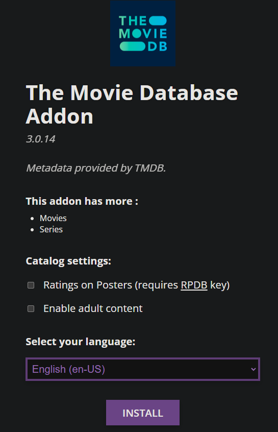

import AddonTemplate from './_addon-template.mdx';

<AddonTemplate id="tmdb-addon" manifest="https://94c8cb9f702d-tmdb-addon.baby-beamup.club/manifest.json" configurable={true} source="https://github.com/mrcanelas/tmdb-addon" /> 

The TMDB addon that will fetch data from The Movie Database to display Popular and New Movies and Series. 
It is recommended that you install this addon as it will provides alternate metadata that may result in more links for some series/shows. 

1. Head to the [TMDB Addon Configuration page](https://94c8cb9f702d-tmdb-addon.baby-beamup.club/configure)
2. Configure the catalogue settings: 
    - `Ratings on Posters`: This will show the ratings on the posters of the movies and series. ([How do I obtain a RPDB API Key?](faq#how-do-i-obtain-a-rpdb-api-key))
    - `Show Adult Content`: This will show adult content in the catalogue if enabled. 
3. Select your language 
4. Click Install. 
5. Stremio should now open and a prompt asking you to install should appear, click Install again.

The addon should now be installed.