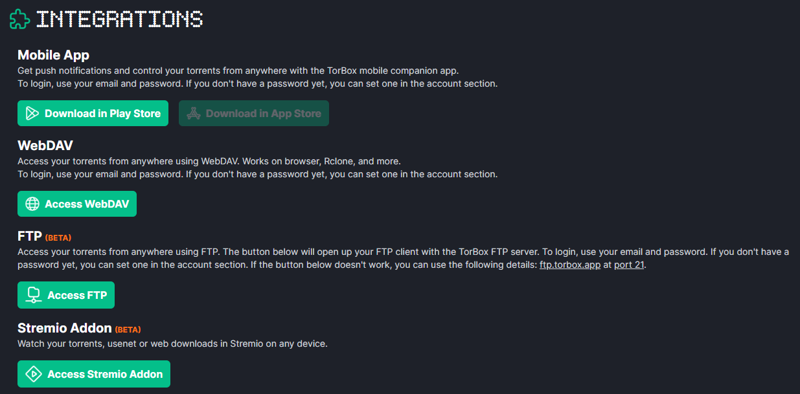
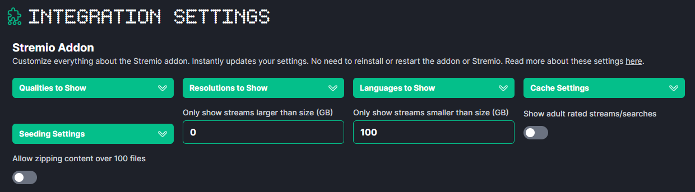

import AddonLinks from './_addon-links.mdx';

<AddonLinks id="torbox" manifest="https://stremio.torbox.app/manifest.json" configurable={true} configurationRequired={true}/> 

The Torbox addon is an addon developed specifically for Torbox (a debrid service). 
It will not work with other debrid services (like Real-Debrid, Premiumize, etc).

<h3>Configuration</h3>

To install the Torbox addon: 

1. Go to your [Torbox Dashboard](https://torbox.app/dashboard)
2. Ensure you are logged in 
3. Then go to the [Settings page](https://torbox.app/settings)
4. Scroll down to the `Integration Settings`. 
    
5. Click `Access Stremio Addon` 
6. This should open a prompt in Stremio asking to install the addon. Click Install again.
    :::tip
    If you don't have the Stremio app installed, you can right click the `Access Stremio Addon` button and copy the link.
    Then paste it into the search bar in Stremio or if on Stremio Web (iOS too), click the + Add Addon button and paste the link in there.
    :::
7. Once the addon has been installed, you can go back to the `Integration Settings`. 
   You should now see configuration options for the Torbox addon.
    
8. These are my personal configurations: 

    `Qualities to Show`: This setting controls what qualities are shown in the results.
                         I have all of them except CAM selected. This is because I don't want to see CAM quality content.

    `Resolutions to Show`: This setting controls what resolutions are shown in the results. 
                           I have all of them selected. This is because I want to see all resolutions.

    `Languages to Show`: This setting controls the language of the results.
                         I have all of them selected. This is to maximise result. 

    `Cache Settings`: This setting controls what type of results are shown. As a reminder, cached results are results that are ready to stream immediately, and download results are results that need to be downloaded to the debrid service before they can be streamed.
                      I select `Cached and Download`. This is because I want to see all results, even if it is not cached so that I can cache it myself.
    
    `Seeding Settings`: This setting controls whether torrents are seeded when you select one. I'm not sure what the difference between Auto and Always is. Never would mean that the torrent is not seeded.
                        I select `Always`. This is because I want to help seed the torrents I watch.
    
    `Size Limits`: The next two settings control the size of the torrents shown. You can set a minimum and maximum size. Files that are smaller or larger than these sizes will not be shown.
                   I leave the minimum size at 0 and maximum size at 200. This is because I want to see all results.
    
    `Show adult rated streams/searches`: This setting controls whether adult content is shown in the results. 
                                        I leave this unchecked. This is because I don't want to see adult content.
    
    `Allow zipping content over 100 files`: I am not sure what this setting does. I leave it unchecked.

9. Your configurations are updated automatically. You can now search for content in Stremio and the Torbox addon will provide results.
:::tip
If you want to change your configurations, you can do so at any time by going back to the `Integration Settings` and changing the settings there. 
:::   
