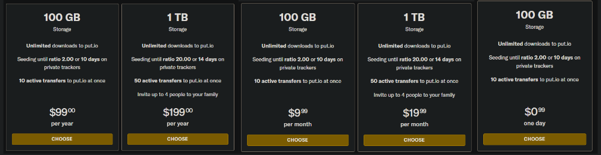
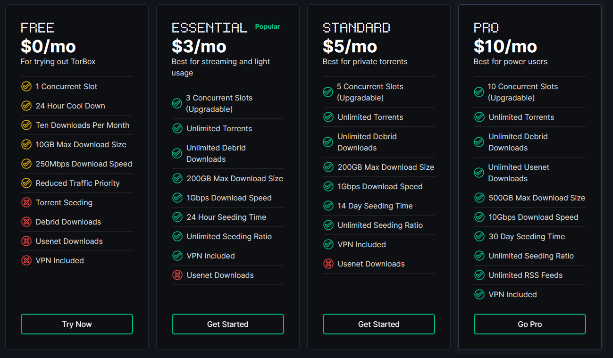
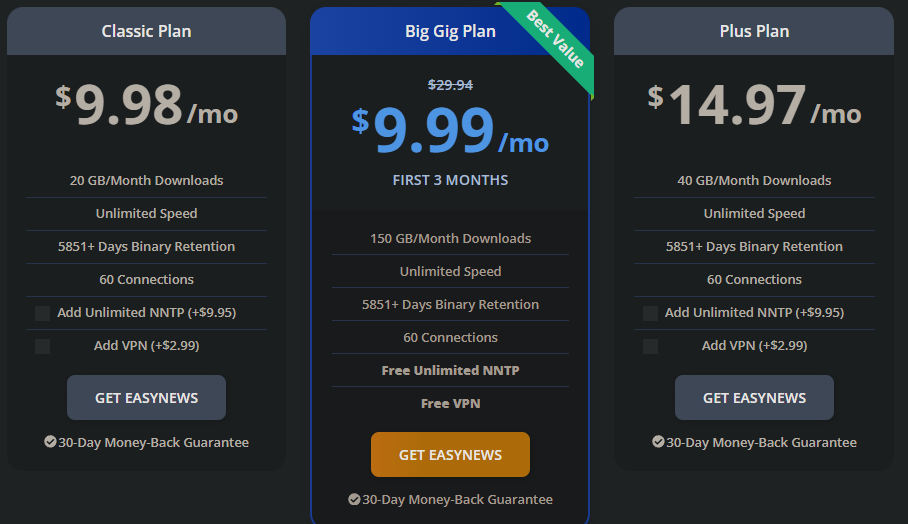
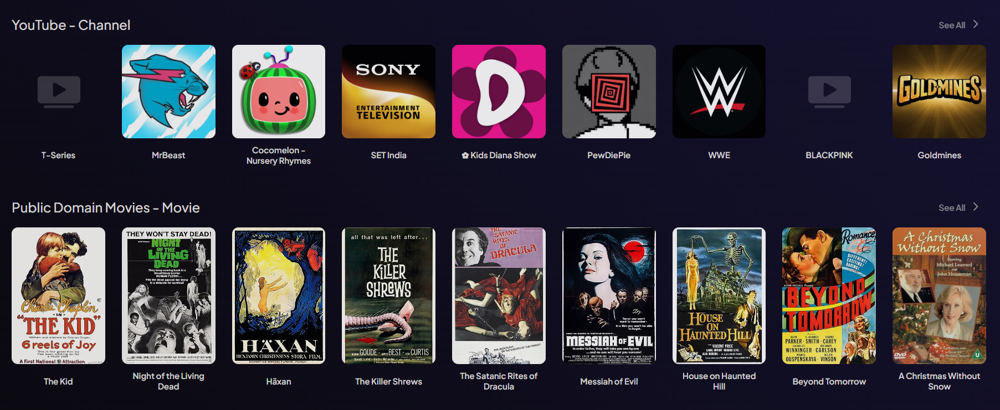

import Tabs from "@theme/Tabs";
import TabItem from "@theme/TabItem";
import Admonition from "@theme/Admonition";

import Web from "./platform/_web.mdx";
import Pc from "./platform/_pc.mdx";
import Android from "./platform/_android.mdx";
import AndroidTv from "./platform/_android-tv.mdx";
import FireTv from "./platform/_fire-tv.mdx";
import SamsungTv from "./platform/_samsung-tv.mdx";
import LgTv from "./platform/_lg-tv.mdx";
import RasberryPi from "./platform/_rasberry-pi.mdx";
import MetaQuest from "./platform/_meta-quest.mdx";

import Torrentio from "./addons/_torrentio.mdx";
import MediaFusion from "./addons/_mediafusion.mdx";
import KnightCrawler from "./addons/_knightcrawler.mdx";
import StremioJackett from "./addons/_stremio-jackett.mdx";
import Annatar from "./addons/_annatar.mdx";
import Comet from "./addons/_comet.mdx";
import Jackettio from "./addons/_jackettio.mdx";
import Orion from "./addons/_orion.mdx";
import Torbox from "./addons/_torbox.mdx";
import Easynews from "./addons/_easynews.mdx";
import EasynewsPlus from "./addons/_easynews-plus.mdx";
import Formulio from "./addons/_formulio.mdx";
import Shluflix from "./addons/_shluflix.mdx";
import Stremify from "./addons/_stremify.mdx";
import JaMovies from "./addons/_jamovies.mdx";
import StremioGDrive from "./addons/_stremio-gdrive.mdx";
import UsaTv from "./addons/_usa-tv.mdx";
import Tmdb from "./addons/_tmdb.mdx";
import Imdb from "./addons/_imdb.mdx";
import CyberFlix from "./addons/_cyberflix.mdx";
import StreamingCatalogs from "./addons/_streaming-catalogs.mdx";
import AnimeKitsu from "./addons/_anime-kitsu.mdx";
import AnimeCatalogs from "./addons/_anime-catalogs.mdx";
import Animeo from "./addons/_animeo.mdx";
import MalStremioAddon from "./addons/_mal-stremio-addon.mdx";


# Guide

I will now begin the guide to setting up Stremio and its addons.
I recommend that the **initial setup is completed on your laptop or desktop**.
Once it has been setup, you can log in to Stremio with the same account on any device and your configuration will be synced to the device so there is no need to set it up again.

## Creating a Stremio Account

First, we need to create a Stremio account. This allows you to keep your progress on different content synced across devices and also allows you to sync your configuration so that it does not need to be repeated.

Head over to [Stremio](https://stremio.com/) and either [sign up for an account](https://www.stremio.com/register) with an email or [login](https://stremio.com/login) through Facebook.

## Downloading Stremio

Head to the [downloads page](https://stremio.com/downloads) and download the required package.
:::warning
If you want to use Stremio on your iPhone or iPad, click the `Web` tab and then the `iOS` tab.
:::

Here are the instructions for each platform, if you are viewing on a mobile phone, you will need to scroll horizontally to see all the different platform instructions. 

<Tabs className="custom-tabs" queryString="platform">

	<TabItem value="web" label="Web" default>

        <Web/>
		
	</TabItem>

	<TabItem value="pc" label="PC">

        <Pc/>

	</TabItem>

	<TabItem value="android" label="Android">
		
        <Android/>

	</TabItem>

	<TabItem value="fire-tv" label="Fire TV">

        <FireTv/>

	</TabItem>

	<TabItem value="android-tv" label="Android TV">
    
        <AndroidTv/>

	</TabItem>

	<TabItem value="samsung-tv" label="Samsung TVs">
		
        <SamsungTv/>

	</TabItem>

	<TabItem value="lg-tv" label="LG TVs">

        <LgTv/>

	</TabItem>

	<TabItem value="rasberry-pi" label="Rasberry Pi">

        <RasberryPi/>

	</TabItem>

	<TabItem value="meta-quest" label="Meta Quest">

        <MetaQuest/>

	</TabItem>

</Tabs>

## Configuring Stremio settings

Although Stremio is mostly ready to use out of the box, one setting you should turn on is hardware accelerated decoding. This can avoid issues relating to crashing while playing content.

And if you are planning on torrenting, then set the torrent profile to Ultra Fast and the cache size to 10GB or infinite.

## Debrid Service

I will now go through what a debrid service is and why you should use it.

**It is not required** and most torrent addons can be used without one.
You would still be able to stream torrents as long as it has enough seeders.
However, using a debrid service will provide a better experience.

### What is a debrid service?

A debrid service is a service that allows you to generate unrestricted (up to 1gbps) download links for torrents and other files on supported hosters (It has more features that are discussed in [Debrid Services](technical-details#debrid-services)).

It brings the following benefits:

- Using a debrid service allows you to stream torrents without the risk of receiving a notice from your ISP as you would be streaming through HTTPS
- While you are streaming something, you are not reliant on the number of seeders and can stream at up to 1gbps speeds. This makes it possible to stream some of the highest quality content available (4K, DV, HDR, Dolby Atmos, etc.) without buffering as long as your internet connection can handle it.
- If you are using a debrid service, a VPN is not required as you are streaming through HTTPS.
- You can use it for more than just Stremio. You can use it to download any type of file, whether that be games, software or audio. If it is a torrent or a file on a supported hoster, you can download it through your debrid service.

However, the drawbacks of using a debrid service are that most do not seed the torrents and will also restrict usage to one IP address at a time.
This means that you are not contributing to the torrent and that you can only use the service on one device at a time.

There are some exceptions to this, which I discuss below.

### Should I use a debrid service? 

The answer to this question is dependent on your personal circumstances.

- Whether torrenting puts you at risk of receiving a notice from your ISP
- The popularity (number of seeders) of the content you want to watch
- Whether your internet speed is sufficient to warrant a debrid service

The main reason to use a debrid service is to avoid the risks of torrenting.
As explained earlier, you are streaming through HTTPS and the debrid service essentially becomes the middle-man.
However, if you are in a country where torrenting is not an issue, then a debrid service or VPN is not needed to avoid receiving a notice from your ISP.

The next big reason is to avoid buffering.
However, whether it buffers or not depends on the type of content you are watching and your internet speed.
If the content you want to watch is popular and has a lot of seeders, then you will be able to stream it at a high quality without buffering.
However, torrents of extremely high quality content may still buffer even with a lot of seeders.

Something that is often ignored is that a debrid service cannot increase your download speeds.
If your internet speed is already slow, then a debrid service will not help you stream higher quality content.
You need to have a fast internet speed yourself to capitalise on the benefits of a debrid service.

With all that being said, if torrenting is not an issue, the best way to determine whether you need a debrid service is to try streaming without one.
You can then try watching the content you want to watch and see if it buffers at the quality you want to watch in. 
If it does, then you may want to consider using a debrid service.

### Which debrid service do I use?

:::info
I receive a commission (free days or small amount of money) if you sign up to a debrid service through (some of) the links provided. This is at no extra cost to you and is a way to support me.
:::

There are many debrid services available to use. Here is a list of the ones supported by the most popular Stremio addon - Torrentio. I will walk you through the setup for each below.

- [Real Debrid](https://real-debrid.com/?id=9483829)
- [AllDebrid](https://alldebrid.com/?uid=3n8qa&lang=en)
- [Premiumize](https://www.premiumize.me/)
- [Debrid-Link](https://debrid-link.com/id/EY0JO)
- [Offcloud](https://offcloud.com/?=06202a3d)
- [Put.io](https://put.io/)
- [Torbox](https://torbox.app/subscription?referral=9ca21adb-dbcb-4fb0-9195-412a5f3519bc) (Referral code: 9ca21adb-dbcb-4fb0-9195-412a5f3519bc)

When choosing a Debrid service, the factors you have to consider are cost and the value you get from it which is made up of its optimality and userbase.

Real Debrid, AllDebrid, and Debrid-Link are the cheapest debrid services.
However, Debrid-Link and AllDebrid are the cheapest as they offer a 300 day plan compared to Real-Debrid whose maximum is 180 days.
Other than that, their prices are the same.

Optimality refers to your proximity to the service's servers. The closer you are, the faster the download speeds and thus the better the streaming experience.
The download speeds you get directly determine the quality of the stream you can watch. Make sure to carry out speed tests to determine the best service for you.
The speed tests for each debrid service can be found [here](faq#where-can-i-find-the-speed-tests-for-debrid-services) and on their website too.

A larger userbase means more cached torrents, with Real Debrid and AllDebrid leading.
However, the other debrid services will still have a lot of popular torrents cached.

Support for debrid services varies among addons, with Real Debrid, AllDebrid, and Premiumize being the most supported.
Find a full table of supported debrid services [here](faq#which-debrid-services-are-supported-by-each-addon).

I previously discussed some of the limitations of debrid services, namely the lack of seeding and the restriction to one IP address.
As I said before, there are some exceptions. I will now go through them.

**Seeding**:

:::warning
With the way debrid services work, users of debrid services will always be taking more than they are giving.

The debrid services below will seed the torrent if it hasn't been cached already. 
In the case that its already been cached, they may not seed it, and other users can stream this cached torrent too. 
:::

- Torbox offer a seedbox that can seed for up to an unlimited amount ratio for up to 30 days. This makes it the best debrid service for seeding.
- Debrid-Link offers a seedbox with these limits: 600 torrents and 2.5TB of data transfer per month.
- Premiumize will seed to a 2.0 ratio or for 72 hours. Whichever comes first.
- put.io is similar to Premiumize but the exact numbers are dependent on your plan. Check their pricing page for more information.

**IP Restrictions**:

- Torbox offer up to 10 concurrent slots which means you can use it on up to 10 devices at different locations at the same time.
- Premiumize is the only debrid service that allows multiple IP addresses. However, it does operate on a storage limitation that you may reach depending on your usage.

:::info
All-Debrid offers a free 7-day trial and put.io offers a $0.99 1 day trial, ideal for testing its suitability.
Alternatively, you can use the 15 day package that most debrid services offer to test them out.
:::

One last piece of information to consider is that Real Debrid has gone down more than any other debrid service but it is still a small amount of downtime.

### Setting up a debrid service

I will now cover the instructions of setting up each debrid service I previously mentioned.

<Tabs className="custom-tabs" queryString="debrid">
<TabItem value="real-debrid" label="Real Debrid"> 
    
    
    1. Go to [Real Debrid's website](https://real-debrid.com/?id=9483829)
    2. Click Sign Up to create an account
    3. Go to the Premium Offers page
    4. Choose a package and subscribe. I would recommend using Amazon Pay. Using your bank card is also secure but Amazon Pay is convenient if you already have a payment method setup there. 
</TabItem>
<TabItem value="alldebrid" label="AllDebrid">
    
    
    1. Go to [AllDebrid's website](https://alldebrid.com/?uid=3n8qa&lang=en)
    2. Click `Create an account` at the top and register for an account. 
    3. Go to the Pricing page
    4. Choose a package and subscribe.
</TabItem>
<TabItem value="premiumize" label="Premiumize">
    

    1. Go to [Premiumize's website](https://www.premiumize.me/)
    2. Click Sign Up in the top right corner to create an account
    3. Click `Buy Premium` at the top of the page
    4. Choose a package and subscribe.

</TabItem>
<TabItem value="debrid-link" label="Debrid-Link">
    

    1. Go to [Debrid-Link's website](https://debrid-link.com/id/EY0JO)
    2. Click Register in the top right corner or `Try it Free` on the home page.
    3. Fill in the required details and click `Register`
    4. Click `Premium` in the top right corner
    5. Choose a package and purchase it.

</TabItem>
<TabItem value="offcloud" label="Offcloud">
    

    1. Go to [Offcloud's website](https://offcloud.com/?=06202a3d)
    2. Enter your email and click `Join us for free`
    3. You will be sent an email to set your password, set your password and log in.
    4. Click `Shop` from the navigation bar on the left.
    5. Choose a package and purchase it.

</TabItem>
<TabItem value="put.io" label="put.io">
    

    1. Go to [put.io's register page](https://app.put.io/register) and create an account
    2. You will see a banner asking you to activate your account. Click the button to go to the [billing page](https://app.put.io/billing/activate-account)
    3. Choose a package and purchase it.

    <Admonition type="info">
    Put.io offers two plans for which you can either pay monthly or yearly.
    One plan gives you 100GB of storage and the other 1TB. Depending on the amount and size of files you will be streaming, choose the plan that suits you best.

    I believe that the storage is not made up of the accumulated size of all the files you have downloaded, but rather the amount of files you have downloaded and stored currently.
    You can delete files to make space for new ones.

    However, I am unsure of the accuracy of this information. If you are considering put.io, then I would recommend contacting their support or looking at their FAQ.
    </Admonition>

</TabItem>
<TabItem value="torbox" label="Torbox">

    
    Torbox is a relatively new debrid service but it is unique in that it offers a lot more. 
    It offers : 
    - A generous seedbox that can seed for up to an unlimited amount ratio for up to 30 days.
    - Up to 10 concurrent slots which means you can use it on up to 10 devices at different locations at the same time.
    - Access to Usenet and a VPN. (Usenet is explained in more detailed below. It is simply another way to access more content)

    To set up a Torbox account, follow these steps:

    1. Go to [Torbox's website](https://torbox.app/)
    2. Click `Get Started For Free Now` or `LOGIN` in the top right corner to create an account.
    3. Click `Don't have an account yet?` at the bottom of the page. 
    4. Fill in the email and password fields and click `Continue`
    5. You will be sent an email to verify your email address. Click the link in the email to verify your email address.
    6. You will then be taken to the Dashboard. 
    7. Go to the [Subscription page](https://torbox.app/subscription?referral=9ca21adb-dbcb-4fb0-9195-412a5f3519bc) and choose a package.
        :::info
        You may get an alert saying `Do you want to use this referral code? If you already have a code, this will replace it.` 
        This is because the above link has a referral code in it. You will get 15 days free if you accept my referal code. 

        You may also enter this referral code manually at the bottom of the page:
        ```
        a6e67618-eb3c-44e3-a0ec-6d1e6135ad48
        ```
        :::
    10. Now you can choose the plan you want. You can choose to pay a subscription or a one-time payment. A yearly subscription has the best value.
        :::note
        To access Usenet and the 30 day seeding time, you need to buy the highest tier package - the `Pro` package.
        :::
    11. Once you have decided on a package, click `Subscribe`
    12. Then, follow the steps at the payment page to complete your purchase.

</TabItem>
</Tabs>

## Usenet 

I will now go through what the usenet is and why you may want to use it.

### What is Usenet?

Usenet is a form of decentralised internet communication that consists of various different "newsgroups". 
You can think of a newsgroup as a forum where people can post messages and files. 
For the purpose of Stremio, the files we are interested in are the binaries (NZB files) for video content that are posted to the newsgroups.

Each different newsgroup is dedicated to a specific topic. These newsgroups can have their own moderators and rules.
This is very similar to subreddits on Reddit.


#### Providers

To access Usenet, you need a Usenet provider.
A provider will host the servers that store the content from the newsgroups.
This provider will give you access to their servers where you can download content from the newsgroups.
Usenet providers will be paid services due to the real costs of hosting the servers and the bandwidth required to provide access to the content.

The content on different Usenet providers is theoretically the same as the content on all newsgroups is mirrored across all providers.
However, due to issues like data corruption, takedowns, and different retention periods, some content may not be available on all providers.

For this guide, we will only be considering Easynews and Torbox as Usenet providers as they are the only ones that have addons for Stremio.
However, generally, the factors to consider when choosing a Usenet provider: 
- Data Limits: Depending on your plan, you may have a fixed amount of data you can download per month. You will have to consider how much data you will be downloading and choose a plan accordingly. 
- Retention: This is the amount of time that the provider will store the content for. The longer the retention, the better.
- Connections: This is the number of connections you can have to the server at the same time. The more connections you have, the more devices you can use the service on at the same time, as well as the number of files you can download at the same time.

#### Indexers

Usenet has a lot of content, and to search for this content, most providers will have some sort of search engine that you can use.
However, you may not be satisfied with the search engine provided by your Usenet provider. There may be content on the newsgroups that you cannot find through their search engine.

This is where indexers come in. Indexers are websites that index the content on the newsgroups and allow you to search for content. 
As independent, dedicated services to search for content, they are usually better than the search engine on your Usenet provider.

You can use multiple indexers at the same time to increase the chances of finding the content you want. 
Different indexers may specialise in different types of content. 


### Should I use Usenet?

The main reason to use Usenet is to access more niche content as well as getting files of larger sizes (and thus higher quality, usually) than what is available through torrents.

Just like with debrid services: 

- The usenet providers offer extremely fast download speeds, which mean that only your internet speed will limit the quality of the content you can watch.
- The content is aquired through HTTP with SSL encryption, so you are not at risk of receiving a notice from your ISP.
- The usenet can be used for more than just Stremio. You can download any type of file, it doesn't have to be video files. If it is on the Usenet, you can download it.

Now, most people will not need to use Usenet. Torrents are usually sufficient for most people.
Even if you may need to use Usenet, you will most likely use it as a backup to your debrid service.

However, in some cases, where torrents are not sufficient - such as for German content - Usenet may be the only way to access the content you want.

If you are currently satisfied with your debrid service, then I do not recommend using Usenet. 
However, it can act as a backup to your debrid service if you want to be prepared for any situation. 


### How do I use Usenet with Stremio?

There are only two ways to access Usenet content through Stremio.

One way is through Easynews.
Easynews is a Usenet provider and there are two addons for Stremio that allow you to access their content.

The other way is through Torbox. 
Torbox is a debrid service that offers access to Usenet content. 
Their Usenet service is only available on their highest tier package - the `Pro` package.
They have undisclosed providers and indexers that they use to provide access to Usenet content.
Torbox have their own Stremio addon that allows you to access their content.

I will now go through the setup for each of these services. 
Although Torbox has been covered previously, I will go through it again. 

<Tabs className="custom-tabs" queryString="usenet">

<TabItem value="easynews" label="Easynews">
    

    1. Head to [Easynews's signup page](https://signup.easynews.com/checkout/) 
    :::tip
    There is currently a deal where you can get the features of the Big Gig Plan for $44.85 / 15 months ($2.99 / month).
    Use [this link](https://signup.easynews.com/checkout/deal-for-you) to get this deal.
    :::
    2. Choose a package, fill in your details and subscribe.
    3. Complete the payment and signup process.
</TabItem>

<TabItem value="torbox" label="Torbox">

    

    To set up a Torbox account with Usenet support, follow these steps:

    1. Go to [Torbox's website](https://torbox.app/)
    2. Click `Get Started For Free Now` or `LOGIN` in the top right corner to create an account.
    3. Click `Don't have an account yet?` at the bottom of the page. 
    4. Fill in the email and password fields and click `Continue`
    5. You will be sent an email to verify your email address. Click the link in the email to verify your email address.
    6. You will then be taken to the Dashboard. 
    7. Go to the [Subscription page](https://torbox.app/subscription?referral=9ca21adb-dbcb-4fb0-9195-412a5f3519bc).
        :::info
        You may get an alert saying `Do you want to use this referral code? If you already have a code, this will replace it.` 
        This is because the above link has a referral code in it. You will get 15 days free if you accept my referal code. 

        You may also enter this referral code manually at the bottom of the page:
        ```
        a6e67618-eb3c-44e3-a0ec-6d1e6135ad48
        ```
        :::
    10. To be able to access Usenet, you need to buy the highest tier package - the `Pro` package.
    11. Click `Subscribe` on the `Pro` package.
    12. Then, follow the steps at the payment page to complete your purchase.
</TabItem>
</Tabs>

These steps only cover the setup of the Usenet service. 
To access the content, you will need to use the Stremio addons for Easynews and Torbox.
I will now go through the setup of these addons. Look for the Easynews and Torbox addons.

## Setting up Addons

As I mentioned before, the intial setup should be done on a laptop/desktop or an android device. Once you have set up the addons, you can log in to Stremio on any device and your configuration will be synced to that device.

Before we install the addons, we need to go through some of the pre-installed addons.

:::info
If you are attempting to install addons on your **iPhone** or using **Stremio Web** then you will need to use the [manual method of adding addons through a link](faq#how-do-i-install-an-addon-manually).
:::

### Removing pre-installed addons




The first picture above shows that when you click on a movie, Stremio will display links to third party streaming services that provide the selected content. 
The addon that does this is called WatchHub.

The second picture shows catalogues from two different addons - YouTube and Public Domain Movies. 
The YouTube addon will show popular YouTube channels and allow you to view their latest videos. 
The Public Domain Movies addon will show movies that are now in the [Public Domain](https://en.wikipedia.org/wiki/Public_domain). 
Most of these movies are quite old and released in the 1900s.

These addons are not required so it is recommended that they be removed. 
If, however, you prefer to keep them, then you may do so.

To remove these addons, go to the addons page (the puzzle icon on the navigation menu on the left of the screen) and click Uninstall on the following addons.


### Stream Provider Addons

I will now go through some addons that provide content to Stremio.

These addons are the backbone to our on-demand streaming experience. 
They provide the video content that allows us to watch anything we want.

You can have a look at this [community hosted addon list](https://stremio-addons.netlify.app/) to view all the available addons.
This list will have more addons listed than the ones shown in the Stremio app.


Please refer to the key below to understand the different types of addons. 

|  Key                      |  Addon Type  | Explanation     |
| :---------------------:   | :----------: | :--------------- |
|   :busts_in_silhouette:   |   Torrent    | Torrent addons rely on a peer to peer network consisting of seeders - people who have the file and are uploading it, and peers - other people who are also downloading the torrent from seeders <br/><br/>The quality available through torrents is much higher as no centralised server is required to host the content or pay for bandwidth.|
|   :globe_with_meridians:  |    HTTP      | HTTP addons provide direct links to content on a centralised server.<br/><br/>These are usually of lower quality due to hosting and bandwidth costs. |
|   :cloud:                 |    Debrid    | An addon that supports debrid services allow you to stream torrents through HTTPS without the need to torrent. <br/><br/>The quality of content is much higher due to it being based on torrents, a decentralised network, thus avoiding the bandwidth and hosting costs. The debrid service itself, however, is centralised. With the debrid service storing the files on their high speed server. This allows streaming without buffering and without exposing your IP. | 
|   :newspaper:             |    Usenet    | These are addons that show links from Usenet newsgroups. <br/><br/>You can usually find niche content or higher sized files on Usenet, and as it is a paid service, the speeds are also very high, only being limited by your own internet speeds.             |

:::tip
If an addon only has the :busts_in_silhouette: icon, then it is a torrent addon, and you cannot use it with a debrid service

If an addon only has the :cloud: icon, then it requires a debrid service. 

An addon that has both the :busts_in_silhouette: and :cloud: icons is a torrent addon that supports debrid services. So you may use it without a debrid service.
:::

If you are curious about which debrid services are supported by each addon, you can find a table [here](faq#which-debrid-services-are-supported-by-each-addon).


#### General Addons

These addons provide general content such as movies, shows and anime.
 
It is not required for you to install all of these addons. 
For most users, only installing the Torrentio addon will be sufficient. 
You may also want to install some backup addons in case Torrentio goes down.

The HTTP addons should only be used if you are not using any other type of addon. 

<details>
    <summary>Torrentio :busts_in_silhouette: :cloud:</summary>
    <div>
        <Torrentio/>
    </div>
</details>

<details>
    <summary>KnightCrawler :busts_in_silhouette: :cloud:</summary>
    <div>
        <KnightCrawler/>
    </div>
</details>

<details> 
    <summary>MediaFusion :busts_in_silhouette: :cloud: </summary>
    <div>
        <MediaFusion/>
    </div>
</details>

<details> 
    <summary>Stremio-Jackett :busts_in_silhouette: :cloud: </summary>
    <div>
        <StremioJackett/>
    </div>

</details>

<details>
    <summary>Orion :busts_in_silhouette: :cloud: :newspaper:</summary>
    <div>
        <Orion/>
    </div>
</details>

<details> 
    <summary>Comet :cloud:</summary>
    <div>
        <Comet/>
    </div>
</details>

<details>
    <summary>Annatar :cloud:</summary>
    <div>
        <Annatar/>
    </div>
</details>

<details>
    <summary>Jackettio :cloud:</summary>
    <div>
        <Jackettio/>
    </div>
</details>

<details>
    <summary>Torbox :cloud: :newspaper:</summary>
    <div>
        <Torbox/>
    </div>
</details>

<details>
    <summary>Easynews :newspaper:</summary>
    <div>
        <Easynews/>
    </div>
</details>

<details>
    <summary>Easynews Plus :newspaper:</summary>
    <div>
        <EasynewsPlus/>
    </div>
</details>

<details>
    <summary>JaMovies :globe_with_meridians:</summary>
    <div>
        <JaMovies/>
    </div>
</details>

<details>
    <summary>Stremify :globe_with_meridians:</summary>
    <div>
        <Stremify/>
    </div>
</details>

<details>
    <summary>Shuflix :globe_with_meridians: </summary>
    <div>
        <Shluflix/>
    </div>
</details>

<details>
    <summary>stremio-gdrive :globe_with_meridians: </summary>
    <div>
        <StremioGDrive/>
    </div>
</details>


#### Sports

These addons provide sports. These can be replays or live streams.

<details>
    <summary>Formulio :busts_in_silhouette:</summary>
    <div>
        <Formulio/>
    </div>
</details>


- [Mediafusion](https://mediafusion.elfhosted.com/configure) provides streams for live sports and replays. 
  I believe the live streams are HTTP and the replays are torrents. It will say P2P in the title if it is a torrent.
  :::tip
  I have covered the setup for this addon above. 
  :::


#### Live TV

These addons provide live TV channels.

<details>
    <summary>USA TV :globe_with_meridians:</summary>
    <div>
        <UsaTv/>
    </div>
</details>

- If you have an IPTV provider, you can use the [xtremio](https://xtremio.elfhosted.com/configure) addon to watch content from your IPTV provider.


----

The basic setup for Stremio has now been completed. You can now search for a movie and you will be provided with high quality links to stream from.

However, your home page will be quite empty. 
The next section will go through how to populate your home page with popular movies and shows.
You will also not have any subtitles, so I highly recommend that you continue to read this guide to the end to get the full experience.

It is also possible to populate your homepage with customised lists such as recommendations or a list that dynamically updates according to strict filters that you can customise.
I will go through this in the [Using Trakt](extras/trakt) section of this guide. 
I highly recommend that you read this section as it will provide you with a more personalised experience.


### Catalogue Addons

These are the addons that provide the different catalogues (the rows of movies/shows) on your Stremio homepage.

There is one built-in addon called cinemeta which provides Popular and Featured Movies and Series.
However, there may be some shows that provide more results with the TMDB addon, so I highly recommend that you install the TMDB addon.

:::warning
The order in which you install the addons is important. Stremio will display the catalogues in the order that you install the addons.
There is currently no way to rearrange the order of the catalogues within Stremio.
However, you can use this unofficial [Stremio Addon Manager](extras/addon-manager) to change the order of the addons which would change the order that the catalogues are displayed in Stremio.
:::

#### General Catalogues

These addons provide general catalogues of movies and shows such as popular, trending, new, featured, award-winning etc.

<details>
    <summary>TMDB Addon</summary>
    <div>
        <Tmdb/>
    </div>
</details>

<details>
    <summary>IMDB Catalogs</summary>
    <div>
        <Imdb/>
    </div>
</details>

#### Streaming Service Catalogues

These addons will provide catalogues that pull movies and shows from popular streaming services (e.g. Netflix, Prime, Hulu, Disney+ etc.).

I recommend only installing one of them. If you install multiple, you may see the same content multiple times on your homepage.
You can try both to see which you prefer but I recommend Streaming Catalogs.

<details>
    <summary>Streaming Catalogs</summary>
    <div>
        <StreamingCatalogs/>
    </div>
</details>

<details>
    <summary>CyberFlix</summary>
    <div>
        <CyberFlix/>
    </div>
</details>

#### Anime Catalogues

I will now go through some Anime catalogue addons. A reminder that these addons are only catalogue addons and do not provide any links themselves.
However, Torrentio with the NyaaSi and AniDex providers enabled should provide you the necessary links.

The Stremify addon also provides streams from Gogoanime if you are looking for http streams.

Scroll up to the [Stream Provider Addons section](#stream-provider-addons) to see how to configure Torrentio and Stremify.

:::note
If you are planning to only watch on an android device, you may want to look into [Aniyomi](https://aniyomi.org) instead.
It also has a torrentio extension that supports watching normal movies/show.
:::

<details>
    <summary>Kitsu</summary>
    <div>
        <AnimeKitsu/>
    </div>
</details>

<details>
    <summary>Anime Catalogs</summary>
    <div>
        <AnimeCatalogs/>
    </div>
</details>

<details>
    <summary>animeo - AniList Catalogues and Tracking</summary>
    <div>
        <Animeo/>
    </div>
</details>

<details>
    <summary>MAL Stremio Addon</summary>
    <div>
        <MalStremioAddon/>
    </div>
</details>

### Subtitle Addons

Here are a list of working subtitle addons. This list may become outdated, please check the [community addons list with the subtitle filter](https://stremio-addons.netlify.app/?label=subtitles) if none of these work.

- [Official OpenSubtitles v3](https://opensubtitles-v3.strem.io/)
- [SubDL](https://subdl.addstrem.site/configure)
- [yifysubtitles by dexter21767](https://2ecbbd610840-yifysubtitles.baby-beamup.club/configure/)
- [Subscene - Reborn (UFO)](https://subscene.stremio.homes/)
- [OpenSubtitles (UFO)](https://opensubtitles.stremio.homes/)
- [MSubtitles](https://msubtitles.lowlevel1989.click/conf/api/v1/configure) (You need to add subtitles on the website)
- Legendasdivx - Addons for PT-PT and PT-BR. Must be registered. https://www.legendasdivx.pt/

## End of inital setup

Done!
You have now setup Stremio and have one of the best on demand streaming experiences available.

I highly recommend checking out the [Extras](extras) section for more information on how to get the most out of Stremio.
This includes using tracking services such as Trakt to get personalised recommendations and customised lists.

You can also check the [FAQ](faq) for any questions you may have or the [Troubleshooting](troubleshooting) page if you encounter any issues.
