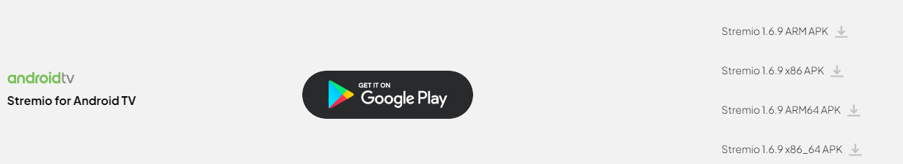

Stremio can be installed from the [Play Store](https://play.google.com/store/apps/details?id=com.stremio.one).

However, you can also download one of the following:

You will most likely need to download the ARM APK.

- ARM (armeabi-v7a) - 32 bit
- ARM64 (arm64-v8a) - 64 bit
- x86 - 32 bit Intel
- x86_64 - 64 bit Intel

Once the Stremio app is installed, open it and log in with the account you created earlier.