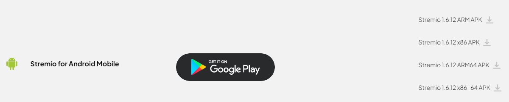

Stremio can be installed from the [Play Store](https://play.google.com/store/apps/details?id=com.stremio.one). 

However, you can also download the APK for your device from [Stremio's download page](https://www.stremio.com/downloads)

:::warning
Stremio is not available in all regions on the Play Store.
If you cannot find it in the Play Store, you will have to sideload it by using the APK from the Stremio website.
:::

You will most likely need to download the ARM64 APK.

- ARM (armeabi-v7a) - 32 bit
- ARM64 (arm64-v8a) - 64 bit
- x86 - 32 bit Intel
- x86_64 - 64 bit Intel

Once the Stremio app is installed, open it and log in with the account you created earlier.
