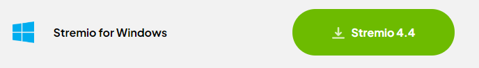
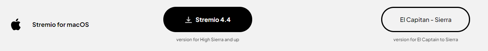
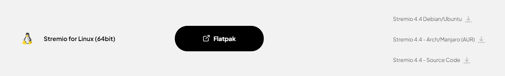

Go to [Stremio's download page](https://www.stremio.com/downloads) and download the appropriate package for your system.

If you need help determining which package to download, refer to the following:

For windows, download the following:

For Mac OS, download one of the following depending on your version of Mac OS:

For Linux, download one of the following:

There are packages available for popular distributions of Linux such as Debian and Arch Linux. However, there is also a flatpak link as well as a link to the source code.

The flatpak can be used to install Stremio on the Steam Deck too.

Once you have downloaded the package for your system, install it and open Stremio. 
Then, log in with the account you created earlier.
