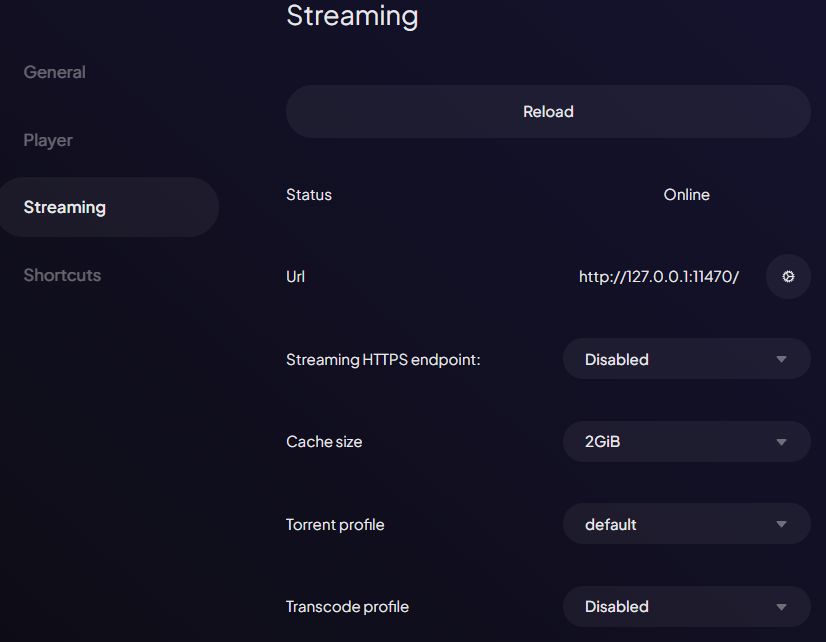

import Tabs from "@theme/Tabs";
import TabItem from "@theme/TabItem";
import Admonition from "@theme/Admonition";

[Stremio Web](https://web.stremio.com) is a web version of Stremio doesn't require any signup or installation.

**The following steps are for using Stremio Web only**. 
If your device has a dedicated app, then you should use that instead.
You will see a separate tab if your device has a standalone app available.

<Tabs className="custom-tabs" queryString="web-platform">
        
    <TabItem value="ios" label="iPhone & iPad" default>

        The app available in the App Store is very limited and is pretty useless.

        You can, however, install Stremio Web as an app to your device by following these steps:

        1. **Open Stremio Web on Safari**: Open Safari and go to [Stremio Web](https://web.stremio.com/).
        2. **Add it to your home screen**:
            - Tap the box with an arrow located next to the address bar.
            - Scroll down and tap `Add to Home Screen`
        3. **Access the app**: The Stremio icon will appear on your home screen, allowing you to access Stremio Web directly.

        We aren't quite done just yet. Stremio Web, on its own, does not support torrent playback or streaming videos in the browser.

        To work around this limitation, you could [setup a streaming server on your android phone or desktop.](#stremio-server)
       
        However, this may be inconvenient as you may not have an android phone or you may not want to leave your desktop on 24/7.

        For this reason, I will go through how to use an external player with Stremio Web first. It does, however, have some limitations.

            - Torrent streaming is still not possible. This means **a debrid service is required** to stream torrents.
            - No episode progress tracking.
            - Addon-provided subtitles cannot be used (you can still use the embedded subtitles provided by the video file).

        Here are the steps to set up an external player on your iPhone or iPad:

        1. **Open the Stremio Web App**: Tap the Stremio icon on your home screen to open the app.
        2. **Dismiss the Warning**: Ignore the "streaming server not available" banner by tapping `Don't show again`.
        3. **Access Settings**:
            - Go to the settings menu by tapping the gear icon.
            - Scroll down to the `Player` section and under `Advanced` select `Play in external player`
        4. **Choose an External Player**: Select "Outplayer" or "VLC" from the options. Make sure the chosen player is installed on your device.

        You can now open a link and it should open in the external player you selected.
    </TabItem>

    <TabItem label="Vision Pro" value="vision-pro">
    
        To get the best experience on Apple Vision Pro, you should use the Moon VR Player on Stremio Web. 

        Follow [this blog post](https://blog.stremio.com/how-to-use-stremio-web-on-vision-pro/) to set up Stremio Web on your Apple Vision Pro.
        Ensure that you select the Moon VR Player as the external player when setting up Stremio Web.

        After setting up Stremio Web, you should ensure that Moon VR Player is installed on your Apple Vision Pro.

        Limitations:
            - Torrent streaming is not possible. This means **a debrid service is required** to stream torrents.
            - No episode progress tracking.
            - Addon-provided subtitles cannot be used (you can still use the embedded subtitles provided by the video file).

        To resolve these limitations, you can [setup a streaming server on your android phone or desktop.](#stremio-server)
    </TabItem>

    <TabItem label="PC" value="pc">

        On PC, playback in the browser will work most of the time. However, you may encounter audio issues and you won't be able to stream torrents without a streaming server.

        Therefore, you will need to follow the steps below to [setup a streaming server on your android phone or desktop.](#stremio-server)

    </TabItem>

    <TabItem label="Android" value="android">

        If you are using Stremio Web on your android phone, then you can add it to your home screen for easy access. Here are the steps to do this:

        1. **Open Stremio Web**: Open your browser and go to [Stremio Web](https://web.stremio.com/).
        2. **Add it to your home screen**:
            - The steps for this are different depending on the browser you are using.
            - However, generally, you can do this by tapping the three dots and selecting "Add to Home Screen."
        3. **Access the app**: The Stremio icon will appear on your home screen, allowing you to access Stremio Web directly.

        We aren't quite done just yet. Stremio Web, on its own, does not support torrent playback or streaming videos in the browser.

        To overcome these limitations, you can [setup a streaming server on your android phone or desktop.](#stremio-server)

        Another method to use Stremio Web on your android phone is to use an external player. This method, however, has some limitations:

            - Torrent streaming is still not possible. This means **a debrid service is required** to stream torrents.
            - No episode progress tracking.
            - Addon-provided subtitles cannot be used (you can still use the embedded subtitles provided by the video file).

        Here are the steps to set up an external player:

        1. **Open the Stremio Web App**: Tap the Stremio icon on your home screen to open the app.
        2. **Dismiss the Warning**: Ignore the "streaming server not available" banner by tapping `Don't show again`.
        3. **Access Settings**:
            - Go to the settings menu by tapping the gear icon.
            - Scroll down to the `Player` section and under `Advanced` select `Play in external player`
        4. **Choose an External Player**: Select `VLC`, `MX Player` or `Just Player`. Make sure the chosen player is installed on your device.

        You can now open a link and it should open in the external player you selected.
    </TabItem>

</Tabs>

##### Stremio Server

The steps below can be used to set up a stremio server that is to be used by Stremio Web. 

It is completely optional and not required for most users. 

Stremio Server

On its own, Stremio Web is limited in what it can do. 
You won't be able to stream torrents, you may encounter audio issues and on some devices, you won't be able to play content within the browser.

On iOS, you are most likely using an external player. This has some limitations: 
    - Torrent streaming is still not possible. This means **a debrid service is required** to stream torrents.
    - No episode progress tracking. 
    - Addon-provided subtitles cannot be used (you can still use the embedded subtitles provided by the video file).

By using a streaming server, you can overcome these limitations.
It would mean you can play in the native web browser, stream torrents without a debrid service (though I still recommend you use a debrid service anyways) and have a better experience overall.

This is why it is recommended that you connect Stremio Web to a streaming server. 

There are a few ways to set up a streaming server for Stremio Web. 
You can either run it on your desktop or on your android device.
I recommend using an android device as it can be left on 24/7 more easily than a desktop.

<Tabs queryString="server-device">
    <TabItem value="desktop" label="Desktop">
        You can either use a standalone server with the Stremio Service or use the server that is built-in to the desktop application. 
        If you are planning on using Stremio Web only, then I recommend using the standalone server.

        To get started, first ensure that one of the two is downloaded and installed .

        1. Download the standalone [Stremio Service](https://www.stremio.com/download-service) or the [Stremio Desktop](https://www.stremio.com/download) application.
        2. Run the setup and then launch the application. 
        <Admonition type="note">
        If you are using Stremio Service, you can see if it is running by checking the system tray.
        </Admonition>
        3. Open [Stremio Web](https://web.stremio.com/) 
        4. Go to Settings
        5. Click on the Streaming section, you should see this: 

                
            
            :::tip 
            If it shows the Status as error, try disabling any adblockers/tracking blockers you have enabled.
            On Brave, it will not work without disabling Brave Shields.

            You may need to also add an exception for the Stremio service in your firewall settings.
            :::

        6. The Stremio service has now been correctly set up. However, you can only access it on the same device.
        To access it from another device (in the same network) follow the next steps:

        7. Set the Streaming HTTPS endpoint to your local IP address (this option should appear as a dropdown).
        8. Then copy the Remote URL and paste it into your other device's Stremio settings for the streaming server URL.

        The Stremio service is now set up and can be accessed from another device.
    </TabItem>
    <TabItem value="android" label="Android">

        1. Ensure the [Stremio app](https://play.google.com/store/apps/details?id=com.stremio.one) is installed on your android device. 
        2. Ensure it has the notifications permission
        3. Open the app and go to settings and scroll down to the Streaming Server section.
        4. You should set the cache size to 10GB and torrent profile to Ultra Fast or Fast depending on your internet speed..

            

        5. Below that, you will see the `Performance & Stability` section. Check the `Run as foreground service` option. 

            
        6. You should now see a notification in your notification bar. This means the server is running.

            

        You can now access this server from the android device only.
        To access it from other devices within your network, follow the remaining steps: 

        7. Open [Stremio Web](https://web.stremio.com/) on the same android device that is running the server.
        8. Go to settings and scroll down to the Streaming section 
        9. You should see the following options:

            

        10. Set the Streaming HTTPS endpoint to your local IP address (this option should appear as an option in the dropdown).
        11. Copy the Remote URL and send it to your other device.
        12. On your other device now, open [Stremio Web](https://web.stremio.com/) and go to settings.
        13. Go to the Streaming section and paste the Remote URL into the `Url` field. 

    </TabItem>
</Tabs>

