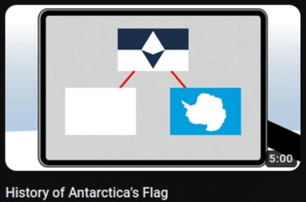

import Tabs from "@theme/Tabs";
import TabItem from "@theme/TabItem";
import Admonition from "@theme/Admonition";

import Extensions from './_browser-extensions.mdx';
import ReVanced from './_android-revanced.mdx';
import TizenTube from './_samsung-tizentube.mdx';
import SmartTube from './_android-tv-smarttube.mdx';

YouTube is a great platform for watching videos.
However, it is riddled with ads, sponsors, and clickbait.

This can all be resolved by using extensions or third-party clients. 

## Adblock 

Adblock works by preventing ads from being loaded in the first place. 
Adblock will block requests to known ad servers, preventing the ads from being displayed.

Adblock is available on multiple platforms and all the clients/platforms I will go through will have the ability to block ads.

Although YouTube has recently been cracking down on adblockers, a good adblocker will still be effective. 
If you are using a browser, I will go through the extension you should be using below in the [Guide](#guide)

## SponsorBlock 

Sponsored segments on youtube are portions of videos where the creator has been paid to promote a product or service.

Although you could manually skip forward to avoid these segments, it is much easier to use an extension like [SponsorBlock](https://sponsor.ajay.app/).

SponsorBlock works by crowdsourcing the timestamps of sponsored segments. 
When you watch a video, the extension will automatically skip the sponsored segments.

You might ask, what about users who attempt to sabotage the extension by submitting false timestamps?
SponsorBlock has a voting system that allows users to vote on the accuracy of the timestamps.
If a timestamp receives enough negative votes, it will be removed.

SponsorBlock supports skipping more than just sponsored segments.
You can also skip intros, outros, reminders to subscribe, non-music sections, and self-promotion.

Another extremely useful feature of SponsorBlock is the ability to skip to the 'highlight' of a video. 
This feature is especially useful for long videos where you only want to watch the most important parts.
You no longer have to watch stretched out 8 minute long videos for a 30 second piece of information.

Although I have described SponsorBlock as an extension, it is actually an [API](https://en.wikipedia.org/wiki/API). 
This is why it is available on different platforms 

SponsorBlock is also heavily configurable. You can choose which segments are displayed to you and what happens for each type of segment. 
You can choose to show a skip button, automatically skip, or do nothing.

I personally choose to show a skip button as it allows me to watch a segment if I want to for whatever reason.

To read more about SponsorBlock, you can visit their [website](https://sponsor.ajay.app/).

## DeArrow 

Nowadays, thumbnails and titles on YouTube are heavily misleading. 
It will often be very hard to discern what the video is actually about from the thumbnail and title. 

Consider this thumbnail:

The thumbnail is designed to show as little information as possible while still being enticing.
The flag is red with a big question mark on it and the title tells you that you **need** to know about it. 
It is not clear what the video is about. 

This is where [DeArrow](https://dearrow.ajay.app/) comes in.

DeArrow, from the same developer as SponsorBlock, is an extension that removes clickbait from YouTube. 
It takes the above thumbnail, and turns it into this: 

The thumbnail and title is much more clear now. 
We can easily tell that the video is about the history of Antarctica's flag. 

Just like SponsorBlock, DeArrow is also a crowdsourced API.

Of course, you may prefer to see the original thumbnails and titles to see the creators original intent. 

To learn more about DeArrow, you can visit their [website](https://dearrow.ajay.app/).

## Guide

Now that I have told you about the 3 most common features that people use to enhance their YouTube experience, 
I will go through the different platforms that you can use these features on and how to set them up.

:::note
Some platforms may have limited or no support for these features.
:::

<Tabs queryString="platform" className="custom-tabs">

<TabItem value="browser" label="Browser">

<Extensions/>

</TabItem>

<TabItem value="android" label="Android">

<ReVanced/>

</TabItem>

<TabItem value="android-tv" label="Android TV">

<SmartTube/>

</TabItem>

<TabItem value="samsung-tv" label="Samsung TV">

<TizenTube/>

</TabItem>

</Tabs>